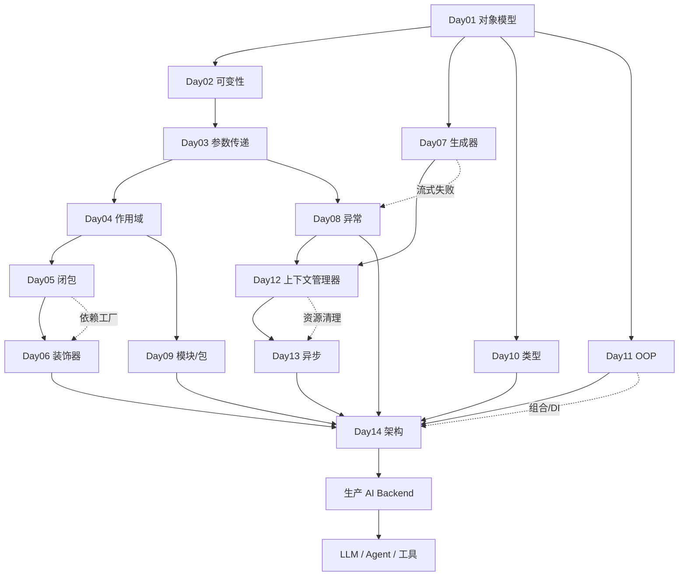

# Interview-QA · AI Backend Engineer 面试题库

> 唯一事实来源：本仓库 `interview/python.md`、`cheat_sheets/python.md`、`docs/python/day01~day14`。
> 用途：面试准备。按 Day01–Day14 组织，每天 ≥10 题。
> 每题格式：**Q** · **A**（标准回答）· **面试官为何爱问** · **容易答错的地方** · **优秀回答如何扩展**。
> 末尾附 [14 天知识关系图](#14-天知识关系图) 与 [面试前 30 分钟速查](#面试前-30-分钟速查)。

---

# Day01 · Python 对象模型

**Q1. Python 里「一切皆对象」是什么意思？**
A：整数、字符串、列表、字典、函数、类、模块都是对象，每个对象有 identity、type、value；变量不直接存对象，而是绑定到对象引用的名字。
面试官为何爱问：考察是否理解 Python 的底层模型，而非只会写语法。
容易答错：说「变量存着对象」；忽略「函数/类也是对象」。
优秀扩展：连到框架——FastAPI 把函数当路由对象、AI backend 把工具存成函数对象。

**Q2. `==` 和 `is` 的区别？**
A：`==` 比较值，`is` 比较对象身份（是否同一对象）。生产中 `==` 做值比较，`is` 只用于 `value is None`。
面试官为何爱问：高频基础题，暴露是否踩过身份/相等的坑。
容易答错：用 `is` 比较字符串或数字（依赖驻留，不可靠）。
优秀扩展：解释为何 `is None` 优于 `== None`——None 是单例，身份判断更快更准。

**Q3. 为什么可变默认参数很危险？**
A：默认值在函数定义时求值一次，可变默认（list/dict）会被所有使用默认值的调用共享，导致跨调用状态泄漏。
面试官为何爱问：经典陷阱，考察对「定义时求值」的理解。
容易答错：以为默认值每次调用重新创建。
优秀扩展：给出修复 `items: list | None = None` + 哨兵；说明在 Web API 里如何造成用户数据串味。

**Q4. 函数是一等对象吗？**
A：是。函数可赋值、传参、返回、存进容器，这支撑了装饰器、依赖注入、回调、AI 工具注册表。
面试官为何爱问：衔接装饰器/DI 的前置概念。
容易答错：只会说「可以」但举不出应用。
优秀扩展：举 FastAPI 用函数对象做路由、AI backend 用函数字典做工具注册。

**Q5. 什么是 callable 对象？**
A：任何能加括号调用的对象。函数是 callable，类是 callable（调用即建实例），实现 `__call__` 的实例也是 callable。
面试官为何爱问：考察对象模型的统一性。
容易答错：忘记类本身也是 callable。
优秀扩展：说明何时用 callable 类替代函数——行为需要携带配置时。

**Q6. 解释 Python 的引用模型。**
A：变量是绑定到对象引用的名字，赋值复制引用而非对象；两名字指向同一可变对象时，通过一个名字变异会被另一个看到。
面试官为何爱问：共享状态 bug 的根源。
容易答错：以为赋值复制对象。
优秀扩展：引出「何时该 copy」「如何避免意外共享变异」。

**Q7. 对象的三要素是什么？**
A：identity（身份/`id()`）、type（类型）、value（值）。
面试官为何爱问：区分 `is` 与 `==` 的理论基础。
容易答错：混淆 identity 和 value。
优秀扩展：连到 ORM——内存对象身份 ≠ 数据库业务身份，判等要用主键不是 `is`。

**Q8. `id()` 有什么用？**
A：返回对象生命周期内的身份，学习期用来验证两个名字是否指向同一对象。
面试官为何爱问：考察是否能用工具验证心智模型。
容易答错：在生产代码里依赖打印 id 判断相等。
优秀扩展：强调生产应设计清晰所有权，而非靠 id 调试。

**Q9. `hello` 和 `hello()` 有何不同？**
A：`hello` 是函数对象本身，`hello()` 是调用它得到的返回值。
面试官为何爱问：考察「传行为还是传结果」的理解。
容易答错：给需要函数对象的地方传了 `hello()`。
优秀扩展：连到回调/装饰器/依赖注入——框架要的是函数对象。

**Q10. Python 的灵活性如何变成生产风险？（Senior）**
A：缺乏约束会导致隐藏可变状态、边界薄弱、运行时错误、所有权不清。生产 Python 需要类型标注、测试、清晰结构、显式依赖、日志、明确错误处理。
面试官为何爱问：考察工程判断力与团队协作意识。
容易答错：只夸灵活，说不出风险与治理。
优秀扩展：谈 code review 会拒绝什么、如何在团队里强制质量（linter/类型/测试）。

---

# Day02 · 可变 vs 不可变

**Q1. 可变和不可变对象的区别？**
A：可变对象创建后可改（list/dict/set），不可变对象不可改（int/str/bool、以及内部全可 hash 的 tuple）。重新赋值不是变异，是把名字绑到另一对象。
面试官为何爱问：并发安全与共享状态的基础。
容易答错：把「改变量名」当成「改对象」。
优秀扩展：共享可变对象会在 FastAPI 请求、Playwright job、AI 会话间泄漏状态。

**Q2. `b = a` 会复制 list 吗？**
A：不会，复制的是引用，两名字指向同一 list；任一方变异对方都能看到。
面试官为何爱问：共享引用高频坑。
容易答错：以为是复制。
优秀扩展：说明何时需要 `copy`/`deepcopy` 隔离。

**Q3. `id()` 如何解释对象身份？**
A：`id(a) == id(b)` 说明二者指向同一对象；学习期用来验证共享。
面试官为何爱问：验证是否真懂引用。
容易答错：生产依赖 id 而非清晰所有权。
优秀扩展：连到调试共享状态 bug 的场景。

**Q4. `append()`、`a += [...]`、`a = a + [...]` 有何区别？**
A：`append` 和 `+=` 原地变异（id 不变，所有引用可见）；`a = a + [...]` 新建 list 并重绑名字（id 变，其他引用不变）。
面试官为何爱问：暴露对变异 vs 重绑定的理解。
容易答错：以为 `+=` 会新建。
优秀扩展：helper 对共享 list `append` 会意外改到调用者数据。

**Q5. 什么是浅拷贝？**
A：`copy.copy()` 拷贝第一层，嵌套可变对象仍共享。
面试官为何爱问：配置/payload 隔离常见坑。
容易答错：以为浅拷贝隔离了嵌套。
优秀扩展：拷贝请求 payload 时嵌套 dict 仍被共享，需 deepcopy。

**Q6. 什么是深拷贝？**
A：`copy.deepcopy()` 递归拷贝整棵对象树，隔离更强但更耗内存与时间。
面试官为何爱问：考察成本意识。
容易答错：盲目用 deepcopy 掩盖所有权不清。
优秀扩展：job 需要完全隔离时用，但不应用它掩盖设计问题。

**Q7. 为什么 list/dict/set 不可 hash？**
A：它们可变，hash 需稳定；若 key 插入后可变，字典将无法可靠定位。
面试官为何爱问：连接缓存 key 设计。
容易答错：说不出「hash 需稳定」。
优秀扩展：缓存/去重 key 用 str/int/安全 tuple。

**Q8. tuple 总能当字典 key 吗？**
A：不总能。只有当 tuple 内全部元素都可 hash 时才行；`("user", [1,2])` 因含 list 而不可 hash。
面试官为何爱问：考察「不可变≠可 hash」的细节。
容易答错：以为 tuple 一定可 hash。
优秀扩展：设计复合 key 时避免嵌套可变容器。

**Q9. 可变性如何影响 FastAPI？**
A：全局可变对象跨请求共享，若把请求数据存全局 list/dict，一个用户的数据会泄漏到另一个请求。
面试官为何爱问：真实生产事故点。
容易答错：忽视多请求生命周期。
优秀扩展：请求态应请求作用域或存 DB，绝不放全局。

**Q10. 可变性如何影响 AI backend？**
A：多用户共享同一 `messages`/`history` 会导致对话串味、隐私问题、错误响应；应按 user/session 隔离存储。
面试官为何爱问：AI 系统特有的状态隔离问题。
容易答错：把会话历史放全局。
优秀扩展：谈 prompt 污染与隐私合规。

**Q11. 可变性如何影响 Playwright？**
A：跨无关 job 共享 page/context/cookie/storage 会让状态互相覆盖，一个 job 可能覆盖另一个的登录态。
面试官为何爱问：自动化 worker 隔离。
容易答错：共享一个 context 跑多个 job。
优秀扩展：为无关的登录/抓取 job 建独立 context。

---

# Day03 · 函数与参数传递

**Q1. Python 如何传递函数参数？**
A：按对象引用传值（call by sharing）——参数是本地名字，指向调用者传入的同一对象。
面试官为何爱问：区分候选人是否真懂 Python 的参数模型。
容易答错：说成纯 pass-by-value 或纯 pass-by-reference。
优秀扩展：用「call by sharing」这一准确术语，并解释重绑定 vs 变异的差异。

**Q2. `append()` 和 `+` 对 list 参数有何区别？**
A：`append` 原地变异共享 list，调用者可见；`items = items + [x]` 只重绑本地名，调用者不可见。
面试官为何爱问：变异 vs 重绑定的具象化。
容易答错：以为两者效果一样。
优秀扩展：决定函数该 mutate 调用者数据还是返回新对象。

**Q3. 为什么函数内能改 list 却不能改 int？**
A：list 可变，`append` 能原地改；int 不可变，`value + 1` 只是新建 int 并重绑本地名。
面试官为何爱问：把可变性和参数传递联系起来。
容易答错：以为传递方式不同（其实都是引用传值，差在可变性）。
优秀扩展：不可变值更安全共享，可变值需明确所有权。

**Q4. 变异和重绑定的区别？**
A：变异改对象本身（调用者可见），重绑定改本地名指向（调用者不可见）。
面试官为何爱问：核心概念，反复出现。
容易答错：混淆两者可见性。
优秀扩展：隐藏变异造 bug，期望重绑影响外部也造 bug。

**Q5. 解释 call by sharing。（Senior）**
A：调用者和函数共享同一对象访问；参数是绑定到该对象的本地名，函数不能重绑调用者的变量，但若对象可变可以原地变异它。
面试官为何爱问：术语准确度 + 概念深度。
容易答错：二选一说成 by value/by reference。
优秀扩展：解释这就是 Python 既不像纯值传也不像纯引用传的原因。

**Q6. 为什么重绑定不影响调用者？（Senior）**
A：参数是函数内的本地名，重绑定只改本地名；调用者是另一个独立的名字，仍指向原对象。
面试官为何爱问：考察作用域 + 引用的综合理解。
容易答错：以为改参数会改到调用者。
优秀扩展：函数若造了新对象，必须 return 出去供调用者使用。

**Q7. 常见的会变异的方法有哪些？**
A：list 的 `append/extend/insert/remove/pop/sort/reverse/clear`；dict 的 `update/setdefault/pop/clear`；set 的 `add/update/remove/discard/clear`。
面试官为何爱问：实战 review 能力。
容易答错：把 `sort()` 和 `sorted()` 混为一谈。
优秀扩展：review 时看到这些方法作用于参数，就要警惕改到调用者状态。

**Q8. 函数造了新对象怎么办？**
A：必须 return，因为重绑定不影响调用者。
面试官为何爱问：闭合「重绑定不可见」的逻辑。
容易答错：造了新 list 却不返回。
优秀扩展：签名用 `-> list` 表达「返新」，`-> None` 表达「原地改」。

**Q9. 参数传递如何影响 FastAPI/Playwright/AI backend？（Senior）**
A：函数收到指向对象的本地名，若对象可变可能改到调用者可见的状态——FastAPI 泄漏请求数据、Playwright 改页面/上下文态、AI 污染共享 messages。
面试官为何爱问：把语言概念落到系统设计。
容易答错：只谈语法不谈系统影响。
优秀扩展：函数边界应表达所有权，隔离请求/job/会话态，造新对象就返回。

**Q10. 为什么 helper 函数会意外改到请求 payload？**
A：payload 作为可变对象传入，helper 若对它 `append`/`update` 就原地改了调用者持有的同一对象。
面试官为何爱问：真实 bug 溯源。
容易答错：以为传进函数就「隔离」了。
优秀扩展：传入前复制或让函数返回新对象，签名表达意图。

---

# Day04 · 作用域与 LEGB

**Q1. LEGB 是什么？** A：名字查找顺序 Local→Enclosing→Global→Built-in。 · 为何爱问：作用域基础。 · 易错：以为全局优先。 · 扩展：`len` 在 Built-in 层找到。

**Q2. 什么是词法作用域？** A：函数按定义位置解析名字，不按调用位置。 · 为何爱问：闭包前置。 · 易错：以为 caller 成了外层作用域。 · 扩展：对比动态作用域，说明词法更易静态推理。

**Q3. 为什么 `count = count + 1` 抛 UnboundLocalError？** A：函数内有对 count 的赋值，Python 编译期判定 count 为局部变量，读取时还没赋值。 · 为何爱问：暴露对「编译期判局部」的理解。 · 易错：以为能直接读同名全局。 · 扩展：`global`/`nonlocal` 或换名修复。

**Q4. `global` 和 `nonlocal` 的区别？** A：`global` 绑定到模块全局作用域，`nonlocal` 绑定到最近外层函数作用域。 · 为何爱问：闭包状态管理。 · 易错：以为 nonlocal 指全局。 · 扩展：两者都会隐藏状态变化，谨慎使用。

**Q5. 为什么 `items.append(1)` 不需要 global？** A：`append` 变异对象，不重绑名字；只有重绑名字才需 global/nonlocal。 · 为何爱问：变异 vs 重绑定的作用域视角。 · 易错：以为变异也要声明。 · 扩展：`items = items + [1]` 就需要了。

**Q6. 什么是闭包？（工程定义）** A：闭包 = 函数对象 + 捕获环境；返回的函数在外层返回后仍能访问定义处变量。 · 为何爱问：衔接 Day05。 · 易错：只说「函数里的函数」。 · 扩展：强调「被返回/延后使用且保留访问」。

**Q7. 什么是晚绑定？** A：闭包在调用时才查捕获变量，循环里造的函数会共享循环变量的最终值。 · 为何爱问：经典 `2 2 2` 坑。 · 易错：以为捕获快照。 · 扩展：`def f(i=i)` 默认参数早绑定固定当前值。

**Q8. 什么是遮蔽（shadowing）？** A：内层同名变量遮蔽外层/内建名字。 · 为何爱问：排查「变量怎么变了」。 · 易错：用 `list`/`id` 当变量名覆盖内建。 · 扩展：避开内建名，减少隐藏 bug。

**Q9. 作用域如何影响 FastAPI/Playwright/AI？（Senior）** A：作用域控制状态来源；隐藏全局态会泄漏 FastAPI 请求数据、混淆 Playwright job、污染 AI 会话。 · 为何爱问：把语言概念落到系统。 · 易错：只谈语法。 · 扩展：请求/页面/会话态归属其生命周期。

**Q10. 为什么请求用户不该存全局？** A：模块全局被所有导入者与所有请求共享，存请求态会跨请求泄漏。 · 为何爱问：真实事故。 · 易错：图方便用全局变量。 · 扩展：用 `Depends` 依赖注入 + 请求作用域。

---

# Day05 · 闭包

**Q1. 什么是闭包？** A：函数对象 + 捕获环境；内层函数保留对定义处变量的访问，即使外层已返回。 · 为何爱问：中高频。 · 易错：只看嵌套结构。 · 扩展：举计数器/工厂例子。

**Q2. 什么是捕获环境？** A：闭包仍需要的外层名字集合，如 `add_prefix` 捕获 `prefix`。 · 为何爱问：理解闭包依赖。 · 易错：以为捕获值的快照。 · 扩展：捕获的是名字，调用时才取值（晚绑定）。

**Q3. 为什么外层返回后内层还能访问其变量？** A：闭包保留了捕获环境的引用，这些变量的生命周期随闭包延续。 · 为何爱问：考察内部机制。 · 易错：以为外层局部变量已销毁。 · 扩展：解释 `__closure__` cell 概念。

**Q4. `nonlocal` 做什么？** A：声明在最近外层函数作用域重绑名字，用于闭包内改外层变量。 · 为何爱问：闭包状态。 · 易错：漏写导致 UnboundLocalError。 · 扩展：变异捕获对象不需要 nonlocal。

**Q5. 闭包 vs 类？** A：小配置小状态、单一行为用闭包；多状态多方法、需要生命周期用类。 · 为何爱问：设计判断。 · 易错：用闭包硬塞复杂状态。 · 扩展：给出选择标准表。

**Q6. 什么是工厂函数？** A：生产「配置好的行为」的函数，如 `make_multiplier(factor)`，分离配置与业务逻辑。 · 为何爱问：闭包最实用形态。 · 易错：把配置写进全局。 · 扩展：支撑依赖工厂、prompt 工厂。

**Q7. 为什么著名循环例子打印 `2 2 2`？** A：晚绑定——三个函数捕获同一循环变量 i，调用时 i 已是最终值 2。 · 为何爱问：经典坑。 · 易错：以为各自捕获快照。 · 扩展：`def f(i=i)` 修复。

**Q8. 为什么 Python 捕获名字而非值？（Senior）** A：闭包引用变量而非复制值，使其能反映后续变化，但也带来晚绑定风险。 · 为何爱问：语言设计权衡。 · 易错：说不清「名字 vs 值」。 · 扩展：`i=i` 显式在定义时取值。

**Q9. 解释 FastAPI 依赖工厂。（Senior）** A：用闭包/工厂返回带配置的依赖函数，把配置注入行为，供 `Depends()` 使用。 · 为何爱问：闭包→框架落地。 · 易错：把配置硬编码。 · 扩展：便于测试替换。

**Q10. 解释 AI backend 的 prompt 工厂。（Senior）** A：闭包捕获 system prompt，返回构建 messages 的函数，分离配置与调用。 · 为何爱问：AI 场景应用。 · 易错：捕获共享可变 messages。 · 扩展：每次构建返回新列表，避免污染历史。

**Q11. 闭包捕获可变态有什么风险？** A：多个闭包共享同一可变对象会互相影响，造成隐藏耦合。 · 为何爱问：生产风险意识。 · 易错：忽视共享。 · 扩展：明确每个闭包的状态所有权。

---

# Day06 · 装饰器

**Q1. 什么是装饰器？** A：接收一个函数、返回一个函数的函数，用于横切关注点。 · 为何爱问：中高频必考。 · 易错：说得很玄。 · 扩展：`@d` 等价 `func = d(func)`。

**Q2. `@decorator` 如何工作？** A：语法糖，等价 `func = decorator(func)`，装饰后函数名指向 wrapper。 · 为何爱问：考察本质理解。 · 易错：不知道名字被替换。 · 扩展：画 original→decorator→wrapper→name 的流程。

**Q3. 什么是 wrapper？** A：装饰后真正被调用的 callable，在原函数前后插入行为。 · 为何爱问：装饰器核心。 · 易错：wrapper 忘记返回原结果。 · 扩展：用 `*args/**kwargs` 通用转发。

**Q4. 为什么用装饰器？** A：把日志/计时/重试/鉴权/缓存等横切关注点与业务解耦、可复用。 · 为何爱问：动机理解。 · 易错：把业务逻辑塞进装饰器。 · 扩展：列举 AI token 追踪等场景。

**Q5. 为什么装饰器通常用 `*args`/`**kwargs`？** A：让 wrapper 能通用转发任意签名的参数。 · 为何爱问：通用性。 · 易错：wrapper 不带导致 TypeError。 · 扩展：配合 `@wraps` 成为标准模板。

**Q6. `functools.wraps` 做什么？** A：保留原函数元数据（`__name__`/`__doc__`/`__annotations__`/签名），供日志、调试、框架使用。 · 为何爱问：细节但关键。 · 易错：漏掉导致日志显示 `wrapper`、破坏 FastAPI/inspect。 · 扩展：「无 wraps 的装饰器默认可疑」。

**Q7. 为什么 `@decorator` 等价 `func = decorator(func)`？** A：装饰器语法就是把函数传给装饰器并把返回值重绑到原名字。 · 为何爱问：本质。 · 易错：以为有魔法。 · 扩展：带参装饰器是三层结构。

**Q8. 为什么 wrapper 成了被调用的函数？** A：因为 `func = decorator(func)` 后，原名字指向 decorator 返回的 wrapper。 · 为何爱问：闭合逻辑。 · 易错：以为还是原函数。 · 扩展：这也是为何要 `@wraps` 伪装元数据。

**Q9. 为什么 FastAPI 大量依赖装饰器？（Senior）** A：声明式注册路由、依赖、元数据，`@app.get` 把函数绑定到路径并解析签名。 · 为何爱问：框架设计。 · 易错：自定义装饰器漏 wraps 破坏签名解析。 · 扩展：连到依赖注入。

**Q10. 装饰器在 AI backend 的真实用途？（Senior）** A：token 统计、请求 tracing、工具调用追踪、限流、重试。 · 为何爱问：AI 场景。 · 易错：记录敏感 prompt/密钥。 · 扩展：日志脱敏、只重试幂等操作。

**Q11. 为什么用装饰器实现横切关注点？（Senior）** A：横切关注点与业务正交，装饰器让其可复用、可组合、不侵入业务。 · 为何爱问：设计判断。 · 易错：把业务塞进装饰器。 · 扩展：对比 AOP 思想。

---

# Day07 · 迭代器与生成器

**Q1. 什么是可迭代对象？** A：能产出迭代器的对象（通常实现 `__iter__`）。 · 为何爱问：协议基础。 · 易错：与迭代器混淆。 · 扩展：一个 iterable 可产多个独立迭代器。

**Q2. 什么是迭代器？** A：逐个产值并记住当前位置的对象（实现 `__next__`）。 · 为何爱问：与 iterable 对比。 · 易错：以为容器就是迭代器。 · 扩展：遍历状态归迭代器。

**Q3. `iter()` 和 `next()` 做什么？** A：`iter` 取迭代器，`next` 取下一个值，耗尽时抛 StopIteration。 · 为何爱问：协议。 · 易错：对耗尽的迭代器再 next。 · 扩展：for 循环底层就是它俩。

**Q4. 什么是 StopIteration？** A：没有更多值时抛出的结束信号。 · 为何爱问：控制流理解。 · 易错：当成崩溃。 · 扩展：为何不用 None——None 可能是真实数据。

**Q5. 什么是生成器？** A：用 `yield` 的函数创建的迭代器，可暂停可恢复。 · 为何爱问：高频。 · 易错：以为调用即执行函数体。 · 扩展：调用只造生成器对象，next 才驱动。

**Q6. `yield` 和 `return` 的区别？** A：`return` 结束并返回一个值，`yield` 产一个值并暂停、可恢复。 · 为何爱问：核心。 · 易错：以为 yield 后函数就结束。 · 扩展：yield 的深层价值是可暂停的数据流，不只省内存。

**Q7. 为什么可迭代和迭代器要分离？（Intermediate）** A：容器可复用、遍历状态归迭代器、可对一个容器开多个独立迭代器、一次性流也能套同协议。 · 为何爱问：设计理解。 · 易错：说不出好处。 · 扩展：数据可共享、状态不共享。

**Q8. 为什么生成器只能消费一次？（Intermediate）** A：生成器的位置状态是一次性的，耗尽后不重启。 · 为何爱问：真实坑。 · 易错：期望重新遍历。 · 扩展：需要复用就转 list；调试用 `list()` 会消费掉。

**Q9. 什么是惰性求值？** A：按需产值，不预先构建全部结果，改善内存与首字节时间。 · 为何爱问：性能理解。 · 易错：以为只是省内存。 · 扩展：连到 StreamingResponse。

**Q10. 为什么 FastAPI StreamingResponse 用生成器？（Senior）** A：生成器边算边产出，实现增量下发，降低内存与首字节延迟。 · 为何爱问：框架落地。 · 易错：忽视流式失败可能在部分输出后发生。 · 扩展：显式资源清理。

**Q11. 生成器被意外消费会有什么生产 bug？（Senior）** A：`list()`/`sum()` 调试或聚合会耗尽生成器，导致后续 streaming 发不出、二次聚合返回 0。 · 为何爱问：实战踩坑。 · 易错：随手 `list(gen)`。 · 扩展：需要复用先物化成 list。

**Q12. 解释「数据可共享，状态不可共享」。（Senior）** A：不可变数据可安全共享，但遍历/会话/连接等状态必须隔离——FastAPI 请求态、Playwright context、LLM 流各自独占。 · 为何爱问：贯穿全课的原则。 · 易错：把状态当数据共享。 · 扩展：每个 LLM 流独占自己的 token 流状态。

---

# Day08 · 异常处理

**Q1. Python 的异常处理是什么？** A：检测、路由、转译、解释失败的机制，用于已知失败路径。 · 为何爱问：基础。 · 易错：用它掩盖未知 bug。 · 扩展：异常是生产控制流，不只防崩溃。

**Q2. `try/except` 和普通控制流的区别？** A：try 内出错时该块后续行不执行，直接跳到匹配的 except。 · 为何爱问：执行顺序理解。 · 易错：以为出错后还往下走。 · 扩展：画 A/C/D 输出例子。

**Q3. 为什么捕获具体异常而非 `except Exception`？** A：只捕你知道怎么处理的异常，保留错误含义，让未知失败上抛。 · 为何爱问：高频。 · 易错：业务里裸 except 吞光。 · 扩展：就近有意义原则。

**Q4. 什么是异常传播？** A：不捕获的异常沿调用栈上抛，直到被处理或到框架边界。 · 为何爱问：分层错误处理。 · 易错：底层过早吞掉。 · 扩展：更高层有更好上下文做日志/重试/转译。

**Q5. 异常在嵌套调用里抛出会怎样？** A：沿调用栈向上传播，直到有 except 捕获或到达框架边界。 · 为何爱问：传播机制。 · 易错：以为就地崩溃。 · 扩展：traceback 记录完整路径。

**Q6. 返回 None 和抛异常的区别？** A：预期缺失返 None，非法状态/破坏不变量则 raise。 · 为何爱问：API 设计。 · 易错：用 None 掩盖错误。 · 扩展：`-> User | None` vs `raise ValueError`。

**Q7. 为什么校验逻辑该抛 ValueError 或自定义异常？** A：非法输入应显式失败而非静默返回，便于上层转译与排障。 · 为何爱问：健壮性。 · 易错：返回 None 掩盖非法输入。 · 扩展：领域异常携带业务含义。

**Q8. 如何设计生产 FastAPI 的异常处理？（Senior）** A：service 抛领域异常，API 边界转 HTTPException，避免暴露内部 traceback。 · 为何爱问：分层错误契约。 · 易错：业务耦合 HTTP。 · 扩展：统一异常处理器。

**Q9. 为什么大型系统需要自定义异常？（Senior）** A：编码领域含义，让 API 映射状态码、worker 决定重试、日志按类型搜索。 · 为何爱问：架构。 · 易错：所有失败塌缩成 None。 · 扩展：`InvalidPromptError`/`LLMRequestError`/`ToolExecutionError`/`RateLimitError`。

**Q10. `raise ... from ...` 解决什么问题？（Senior）** A：转译异常时保留根因，便于追溯。 · 为何爱问：细节。 · 易错：转译丢根因。 · 扩展：`raise LLMRequestError(...) from timeout`。

**Q11. 如何处理 AI backend 的 LLM API 失败？（Senior）** A：保留 provider 根因、区分限流/超时/无效 prompt，映射到领域异常并决定重试。 · 为何爱问：AI 场景。 · 易错：全部当 None。 · 扩展：限流用指数退避重试。

**Q12. Playwright worker 如何区分可恢复与不可恢复错误？（Senior）** A：可恢复超时可重试，不可恢复登录失败应捕获证据（截图）、清理、再抛。 · 为何爱问：自动化健壮性。 · 易错：静默吞掉失败。 · 扩展：用 `PlaywrightTimeoutError` 等具体异常。

---

# Day09 · 模块与包

**Q1. 什么是 Python 模块？** A：作为模块对象加载的 .py 文件，有独立命名空间；不是复制源码。 · 为何爱问：基础。 · 易错：以为导入是复制粘贴。 · 扩展：Python 执行模块并创建运行时模块对象。

**Q2. 什么是包？** A：按职责分组模块与子包的目录，通常含 `__init__.py`。 · 为何爱问：项目组织。 · 易错：把包当纯文件夹。 · 扩展：包是架构边界。

**Q3. `__init__.py` 做什么？** A：标记常规包，可定义包级导出。 · 为何爱问：细节。 · 易错：放连接/启动等重活。 · 扩展：保持轻量，只 re-export 公共名。

**Q4. `import module` 和 `from module import name` 区别？** A：前者保留命名空间，后者直接绑定对象。 · 为何爱问：可读性权衡。 · 易错：过度用 from 隐藏来源。 · 扩展：选让所有权更清晰的方式。

**Q5. 解释 Python 导入执行。（Intermediate）** A：查 sys.modules，未缓存则建模块对象、缓存、执行顶层代码、绑定名字。 · 为何爱问：机制。 · 易错：以为纯声明不执行。 · 扩展：导入即执行顶层代码。

**Q6. 为什么模块只执行一次？（Intermediate）** A：首次导入后缓存在 sys.modules，后续导入复用同一对象。 · 为何爱问：缓存理解。 · 易错：期望每次重新执行。 · 扩展：模块级可变态被所有导入者共享。

**Q7. 什么是 sys.modules？** A：模块名→已加载模块对象的缓存字典。 · 为何爱问：机制细节。 · 易错：不知其保证身份。 · 扩展：`sys.modules["json"] is json` 为 True。

**Q8. 绝对导入 vs 相对导入？（Intermediate）** A：绝对 `from app.services.x import y`，相对 `from .x import y`；大型后端优先绝对。 · 为何爱问：工程规范。 · 易错：深层相对 `from ...x`。 · 扩展：绝对更清晰、可移动。

**Q9. 什么是导入副作用？（Intermediate）** A：因导入模块而发生的实际工作，如连库、启浏览器、调 LLM。 · 为何爱问：启动/测试隐患。 · 易错：顶层放重活。 · 扩展：顶层定义工厂，运行期才执行。

**Q10. namespace 污染会造成什么问题？（Senior）** A：`from x import *` 引入过多名字，导致碰撞、遮蔽、隐藏依赖、难静态分析。 · 为何爱问：可维护性。 · 易错：图省事用 import *。 · 扩展：显式导入。

**Q11. FastAPI 项目该如何组织包？（Senior）** A：按层分包 api/services/repositories/schemas/infra，清晰导入边界。 · 为何爱问：架构。 · 易错：混层。 · 扩展：包即层，衔接 Day14。

**Q12. 模块边界如何影响 AI backend 架构？（Senior）** A：清晰的模块边界让 LLM/browser/repository 可替换、可测试，循环导入是边界警告。 · 为何爱问：架构。 · 易错：忽视循环导入。 · 扩展：依赖方向指向接口。

---

# Day10 · 类型标注

**Q1. 为什么 Python 引入类型标注？** A：作为接口契约，向人、IDE、静态检查、框架、AI 助手描述期望类型。 · 为何爱问：动机。 · 易错：以为强制运行时检查。 · 扩展：默认不检查，FastAPI/Pydantic 才校验。

**Q2. 类型标注在运行时会检查吗？** A：默认不会，Python 本身不校验。 · 为何爱问：常见误解。 · 易错：以为标了就保证。 · 扩展：框架可基于标注做运行时校验。

**Q3. 为什么参数要标注？** A：让调用者知道传什么，暴露契约。 · 为何爱问：基础。 · 易错：给显而易见的局部变量加噪声。 · 扩展：只标公共边界。

**Q4. 为什么返回值要标注？** A：调用者知道拿到什么，缺失情况显式化。 · 为何爱问：契约诚实性。 · 易错：`-> User` 却返回 None。 · 扩展：写 `User | None`。

**Q5. `list[T]` 和 `list` 的区别？** A：`list[T]` 标出元素类型，暴露形状；裸 list 隐藏形状。 · 为何爱问：细节。 · 易错：用裸 list/dict。 · 扩展：`list[User]` 优于 `list`。

**Q6. `Optional` 和 `Union` 的区别？（Intermediate）** A：`Optional[X] == X | None`，是 `Union[X, None]` 的特例；Union 表达多类型。 · 为何爱问：语义。 · 易错：以为 Optional 指「可选参数」。 · 扩展：Optional 是「可能 None」。

**Q7. `User | None` 和 `Optional[User]` 的区别？（Intermediate）** A：语义等价，前者是现代语法。 · 为何爱问：版本知识。 · 易错：混用旧写法。 · 扩展：3.10+ 推荐 `X | None`。

**Q8. 为什么 `list[User]` 比 `list` 好？（Intermediate）** A：保留元素类型，IDE/检查器能校验、补全。 · 为何爱问：实用性。 · 易错：裸 list 隐藏 bug。 · 扩展：`dict[str, object]` 可能藏了该建的模型。

**Q9. 为什么类型标注是接口契约？（Senior）** A：它描述边界的输入输出约定，供人和工具共同遵守，而非运行时锁。 · 为何爱问：设计视角。 · 易错：当成运行时保证。 · 扩展：契约显式改善协作与 AI 辅助编码。

**Q10. 解释 `Generic` 和 `TypeVar`。（Senior）** A：`TypeVar` 声明类型变量保留关系，`Generic` 做可复用泛型包装如 `Response[T]`。 · 为何爱问：进阶。 · 易错：过度泛型化。 · 扩展：`Response[AgentResult]`。

**Q11. 为什么 `T -> T` 比 `object -> object` 好？（Senior）** A：`T->T` 保留输入输出类型关系，`object` 会丢失类型信息。 · 为何爱问：泛型理解。 · 易错：用 object 图省事。 · 扩展：`identity(v: T) -> T`。

**Q12. 什么时候该避免写类型标注？（Senior）** A：显而易见的局部变量不必标，避免噪声；能被推断时留白。 · 为何爱问：判断力。 · 易错：处处标注。 · 扩展：只标公共边界与空集合。

---

# Day11 · 面向对象

**Q1. 什么是对象？** A：有 identity、type、state、behavior 的运行时值。 · 为何爱问：基础。 · 易错：只说「数据」。 · 扩展：一切皆对象，类本身也是对象。

**Q2. 什么是类？什么是实例？** A：类是创建实例的蓝图（也是对象），实例是由类创建的对象。 · 为何爱问：基础。 · 易错：混淆二者。 · 扩展：`type(User)` 是 type，`type(user)` 是 User。

**Q3. 什么是 `self`？** A：当前实例，是约定不是关键字；Python 自动把实例作为第一个参数传入。 · 为何爱问：高频。 · 易错：漏写导致 TypeError。 · 扩展：`u1.hi()` 即 `User.hi(u1)`。

**Q4. 状态 vs 行为？** A：状态是对象拥有的数据，行为是方法；行为依赖状态时放进对象，无状态逻辑用函数。 · 为何爱问：设计。 · 易错：无状态硬塞成类。 · 扩展：给出何时用类的标准。

**Q5. 类属性 vs 实例属性？** A：类属性共享，实例属性隔离；`u1.company="G"` 只遮蔽 u1。 · 为何爱问：常见坑。 · 易错：可变类属性跨实例共享状态。 · 扩展：可变默认状态应放实例属性。

**Q6. 解释属性/方法查找。（Intermediate）** A：实例→类→父类→object，命中即停。 · 为何爱问：override 基础。 · 易错：不懂顺序误判行为。 · 扩展：方法也是属性。

**Q7. 解释继承与方法覆盖。（Intermediate）** A：继承表达 Is-A，子类同名方法覆盖父类，Python 先命中子类方法。 · 为何爱问：OOP 核心。 · 易错：为复用而继承。 · 扩展：只在真 Is-A 时用继承。

**Q8. `super()` 做什么？（Intermediate）** A：委托到 MRO 中下一个类，常用于父类初始化。 · 为何爱问：初始化坑。 · 易错：忘调 `super().__init__()` 父类状态未初始化。 · 扩展：父类 `__init__` 不会自动运行。

**Q9. 为什么用 MRO？（Intermediate）** A：给 Python 确定性的方法查找顺序。 · 为何爱问：多继承。 · 易错：滥用复杂多继承。 · 扩展：简单继承为 Instance→Class→Parent→object。

**Q10. 为什么组合优于继承？（Senior）** A：组合低耦合、可替换、可测试；继承为复用会造成隐藏耦合。 · 为何爱问：架构判断。 · 易错：用多继承拼装依赖。 · 扩展：Is-A 继承、Has-A 组合。

**Q11. 解释 Is-A vs Has-A。（Senior）** A：Is-A 用继承（Chromium is-a Browser），Has-A 用组合（ChatService has-a LLMClient）。 · 为何爱问：建模。 · 易错：混用。 · 扩展：现代后端偏爱组合。

**Q12. 依赖注入与 OOP 的关系？（Senior）** A：DI 通过构造函数传入依赖，让服务依赖显式、可替换、可测试。 · 为何爱问：衔接 Day14。 · 易错：服务内部 new 依赖。 · 扩展：`ChatService(llm, cache)`。

---

# Day12 · 上下文管理器

**Q1. 什么是上下文管理器？** A：保证资源确定性清理的对象，即使函数体抛异常。 · 为何爱问：资源管理基础。 · 易错：以为只是 `with` 语法。 · 扩展：核心是保证 Release。

**Q2. 为什么用 `with`？** A：它是更安全的 `try/finally`，保证清理运行。 · 为何爱问：动机。 · 易错：手动开关漏关。 · 扩展：`with open() as f` 等价 try/finally close。

**Q3. `__enter__` 和 `__exit__` 是什么？** A：`__enter__` 获取资源并返回 as 目标，`__exit__` 释放资源并接收异常信息。 · 为何爱问：协议。 · 易错：`__exit__` 误返回 True 吞异常。 · 扩展：返回 False 异常传播（正常）。

**Q4. 解释资源生命周期。（Intermediate）** A：Acquire→Use→Release，Release 是最常忘的一步。 · 为何爱问：心智模型。 · 易错：漏失败路径的释放。 · 扩展：业务只负责 Use。

**Q5. `yield` vs `return`（上下文场景）。（Intermediate）** A：`return` 无恢复相位，`yield` 可在 resume 后清理。 · 为何爱问：`@contextmanager` 原理。 · 易错：用 return 无处清理。 · 扩展：yield 后 finally 释放。

**Q6. FastAPI 依赖生命周期？（Intermediate）** A：建 session→yield→请求结束后在 finally 关闭，请求作用域。 · 为何爱问：框架落地。 · 易错：清理没放 finally。 · 扩展：handler 只写业务。

**Q7. 如何保证生产环境清理？（Senior）** A：用 `with`/`try-finally`，把 Release 放 finally，`@contextmanager` 的 yield 包在 try/finally。 · 为何爱问：健壮性。 · 易错：close 放业务之后。 · 扩展：多资源反序释放。

**Q8. 上下文管理器在 FastAPI 中的应用？（Senior）** A：yield 依赖管理 DB session，lifespan 管启动/关闭。 · 为何爱问：框架。 · 易错：跨请求共享 session。 · 扩展：请求作用域隔离。

**Q9. 上下文管理器在 Playwright 中的应用？（Senior）** A：共享 Browser、每 job 建并在 finally 关闭 BrowserContext。 · 为何爱问：自动化。 · 易错：跨 job 共享 context。 · 扩展：cookie/storage 隔离。

**Q10. 上下文管理器在 AI backend 中的应用？（Senior）** A：包裹 LLM 流、Redis 连接、DB session、并发锁，防泄漏。 · 为何爱问：AI 场景。 · 易错：忘关 LLM 流导致挂起 socket、浪费 token。 · 扩展：多资源用嵌套/并列 with。

**Q11. 清理设计中的资源所有权？（Senior）** A：谁获取谁释放；业务不该拥有资源管理，上下文管理器拥有 Acquire/Release。 · 为何爱问：职责分离。 · 易错：业务逻辑里手动清理。 · 扩展：逻辑变了清理不该跟着坏。

---

# Day13 · 异步编程

**Q1. 什么是异步？** A：单线程事件循环重叠 I/O 等待，提升 I/O 吞吐而非 CPU 算力。 · 为何爱问：高频。 · 易错：以为是并行/多线程。 · 扩展：只适合 I/O 密集。

**Q2. 什么是 await？** A：挂起当前协程、让出事件循环、就绪后恢复；不创建线程。 · 为何爱问：核心。 · 易错：以为 await 开线程。 · 扩展：让其他 Task 得以运行。

**Q3. 什么是协程？** A：用 `async def` 定义；调用协程函数生成协程对象（执行计划），不执行体。 · 为何爱问：概念。 · 易错：调用却不 await（体不运行）。 · 扩展：协程是计划，Task 是被循环驱动的协程。

**Q4. 解释事件循环。（Intermediate）** A：单线程协作式调度器，Task 运行到 await 就让出循环。 · 为何爱问：机制。 · 易错：以为并行 CPU。 · 扩展：并发=重叠等待。

**Q5. Task vs 协程？（Intermediate）** A：`await coro()` 立即运行并阻塞在此；`create_task(coro())` 调度并发、稍后 await。 · 为何爱问：并发理解。 · 易错：只 await 变顺序执行。 · 扩展：真正并发要 create_task。

**Q6. `gather()` 做什么？（Intermediate）** A：并发运行多个协程，总时约 max(t)，按输入顺序返回结果。 · 为何爱问：并发工具。 · 易错：以为按完成顺序返回。 · 扩展：外部调用要用 Semaphore 限并发。

**Q7. 解释取消。（Intermediate）** A：`cancel()` 是请求，在下个 await 注入 CancelledError，非立即杀死。 · 为何爱问：协作式取消。 · 易错：以为立即停。 · 扩展：except/finally 清理后通常 re-raise。

**Q8. 异步如何提升后端吞吐？（Senior）** A：单线程重叠 I/O 等待，一个请求等待时其他请求推进，提升并发 I/O 吞吐。 · 为何爱问：性能。 · 易错：以为提升 CPU。 · 扩展：CPU 密集用 to_thread/进程。

**Q9. 为什么用 Semaphore？（Senior）** A：限制并发数以保护下游容量，防 429/超时/连接池耗尽。 · 为何爱问：生产并发。 · 易错：追求最大并发。 · 扩展：优化稳定吞吐。

**Q10. 如何控制生产并发？（Senior）** A：Semaphore 限并发 + 429 指数退避重试 + await Task 让异常浮现。 · 为何爱问：实战。 · 易错：无上限 gather。 · 扩展：找瓶颈（限流/DB 池/GPU）。

**Q11. 解释 FastAPI 异步架构。（Senior）** A：每个请求是事件循环上的 Task，`async def` 里绝不阻塞，阻塞工作用 `to_thread`，客户端断开会取消请求 Task。 · 为何爱问：框架。 · 易错：async 里调阻塞驱动冻结全部请求。 · 扩展：长任务用队列+worker。

**Q12. 如何处理 AI backend 并发？（Senior）** A：并发 LLM 调用用 Semaphore 限流、指数退避重试、await 收集结果、finally 清理流。 · 为何爱问：AI 场景。 · 易错：万级并发打爆 OpenAI。 · 扩展：稳定吞吐优先。

---

# Day14 · 迷你项目与后端架构

**Q1. 什么是分层架构？** A：API→Service→Browser→LLM→Repository→DB，每层单一职责，数据向下流、依赖指向接口。 · 为何爱问：架构核心。 · 易错：跨层泄漏。 · 扩展：跑通是脚本，分层才是系统。

**Q2. 什么是依赖注入？** A：从外部传入依赖而非内部构造，让服务可测试、可替换、显式。 · 为何爱问：高频。 · 易错：路由/服务内 new 依赖。 · 扩展：`Depends()` 是请求作用域 DI。

**Q3. 什么是无状态服务？** A：实例不存每请求状态，任何副本可服务任何请求，可水平扩展。 · 为何爱问：扩展性。 · 易错：self 上存请求态。 · 扩展：共享可变状态导致数据泄漏/竞态。

**Q4. 为什么 Browser 层返回数据而非 JSON？** A：基础设施层返回纯数据，让上层决定表示；返回 FastAPI 模型会耦合传输层。 · 为何爱问：分层纯度。 · 易错：browser 返模型。 · 扩展：finally 关 context。

**Q5. 为什么 FastAPI 路由要薄？（Intermediate）** A：路由只校验请求 + 委托 service，业务在无状态 service，便于测试与复用。 · 为何爱问：分层。 · 易错：胖路由写业务。 · 扩展：main.py 只装配。

**Q6. 为什么用 Repository 模式？（Intermediate）** A：隐藏数据库，返回领域对象，service 永不写 SQL。 · 为何爱问：解耦。 · 易错：SQL 向上泄漏。 · 扩展：返回 Task 而非原始行。

**Q7. 为什么把 LLM 藏在接口后？（Intermediate）** A：支持多 provider 故障转移与假实现测试。 · 为何爱问：可替换性。 · 易错：绑死 OpenAI。 · 扩展：OpenAI/Anthropic/Gemini 互换。

**Q8. 什么是共享可变状态？（Intermediate）** A：多请求共享的实例可变状态，导致数据泄漏与竞态。 · 为何爱问：并发安全。 · 易错：service 存请求态。 · 扩展：保持无状态。

**Q9. 如何扩展一个 AI 摘要服务？（Senior）** A：无状态服务 + 队列 + worker + 水平副本；Semaphore 限并发、指数退避、找瓶颈。 · 为何爱问：系统设计。 · 易错：盲目加并发。 · 扩展：命名 trade-off。

**Q10. 如何让慢端点保持响应？（Senior）** A：长任务返回 task_id，worker 后台处理并更新状态，`GET /tasks/{id}` 查询。 · 为何爱问：实战。 · 易错：30 秒阻塞请求。 · 扩展：队列+worker+状态。

**Q11. 这里最重要的 trade-off 是什么？（Senior）** A：稳定吞吐 vs 最大并发——限并发保护下游、换取可预测吞吐。 · 为何爱问：判断力。 · 易错：只追吞吐峰值。 · 扩展：明确命名权衡。

**Q12. Async vs Worker？（Senior）** A：async 给单 worker I/O 吞吐，worker/副本给并行与隔离；两者叠加提升容量。 · 为何爱问：扩展维度。 · 易错：混为一谈。 · 扩展：async 提吞吐、副本提容量。

---

# 企业场景题（跨天综合）

**S1. FastAPI 依赖泄漏。** yield 依赖的清理没放 `finally`，异常时 session 不关闭 → 连接池耗尽。修复：`try: yield db finally: db.close()`（Day08+Day12）。

**S2. Playwright 共享 Page 对象。** 跨 job 共享 page/context 导致状态串味。修复：每 job 独立 context，finally 关闭（Day02+Day07+Day12）。

**S3. AI 工具注册表。** 用函数对象/字典注册工具，callable 统一调用；注意工具失败要抛 `ToolExecutionError` 更新 agent 状态（Day01+Day06+Day08）。

---

# 14 天知识关系图

面试串讲一句话：对象模型是地基 → 作用域/闭包/装饰器管理行为 → 生成器/异常/上下文/异步管理数据与资源 → 类型/模块/OOP 管理结构 → Day14 收敛成分层、可扩展、无状态的 AI 后端。

---

# 面试前 30 分钟速查

**第1页 · Python 对象模型**
`Name→Reference→Object`；对象三要素 identity/type/value；`==` 值 / `is` 身份（只对 None）；可变默认参数用 `None` 哨兵；函数/类/模块都是对象；类是 callable。

**第2页 · 可变性与参数传递**
list/dict/set 可变，int/str/tuple 不可变；`b=a` 共享引用；`append/+=` 原地改、`a=a+[]` 新建重绑；浅拷贝只护壳、深拷贝全隔离；只有不可变可 hash；Python 是 call by sharing，变异可见、重绑不可见。

**第3页 · 作用域 / 闭包 / 装饰器**
LEGB + 词法作用域；`global` 动模块、`nonlocal` 动外层函数；变异免声明、重绑才要；闭包=函数+捕获环境；晚绑定用 `i=i` 修复；`@d` = `func=d(func)`；装饰器必带 `functools.wraps` + `*args/**kwargs` + 返回结果。

**第4页 · 生成器 / 异常**
iterable 产 iterator；`yield` 暂停可恢复；生成器一次性、`list()` 会消费；惰性=省内存+快首响；数据可共享、状态不共享；异常是生产控制流，捕获具体异常、让未知上抛；`raise ... from ...` 保根因；领域异常分类失败。

**第5页 · 模块 / 类型 / OOP**
导入即执行并缓存（sys.modules）；包是架构边界、`__init__.py` 轻量、避免导入副作用；类型标注是接口契约、默认不检查、`User | None` 诚实、`TypeVar` 保关系；OOP 是职责设计；`super().__init__()` 不自动；Is-A 继承、Has-A 组合。

**第6页 · 上下文管理器 / 异步**
Acquire→Use→Release，业务只管 Use；`with`=更安全的 try/finally；`@contextmanager` 的 yield 必裹 try/finally；`__exit__` 返 True 吞异常（慎用）；异步=事件循环重叠 I/O 等待，提吞吐非算力；`async` 里禁 `time.sleep`；协程是计划、Task 才并发；`gather` 按输入序；`Semaphore` 限并发、取消是协作式。

**第7页 · FastAPI 分层**
Request→Router(薄，校验+委托)→Depends(注入)→Service(无状态编排)→Browser/LLM(接口后)→Repository(藏 DB)→Database→Response(响应模型)；路由不写业务、service 不懂 HTTP/SQL。

**第8页 · 生产最佳实践**
无隐藏共享可变态、变异显式、用类型标注、用日志非 print、小函数、依赖注入优于全局、为关键行为写测试；限并发+指数退避+队列/worker；长任务返 task_id。

**第9页 · AI Backend 落地**
FastAPI 路由/依赖 → Service 编排 → Browser(Playwright 返数据) → LLM(provider 接口，多 provider 故障转移) → Repository → DB；并发 LLM 调用用 Semaphore 限流；会话历史按 user/session 隔离；工具是函数对象、失败抛 ToolExecutionError；LLM 流用上下文管理器清理。

**第10页 · 全景关系图**
对象→可变性→参数→作用域→闭包→装饰器（行为线）；对象→生成器→上下文→异步（数据/资源线，异常贯穿）；对象→类型/模块/OOP（结构线）；三线在 Day14 分层架构收敛为生产 AI 后端。核心问题始终是：**谁拥有这个状态？**

