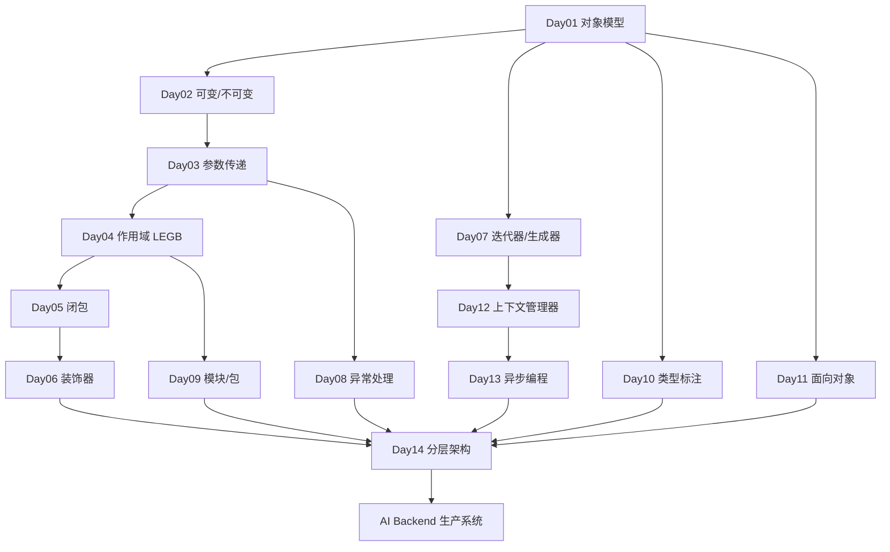
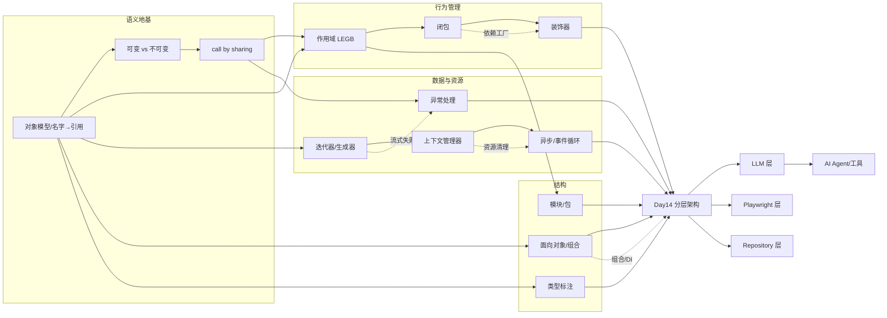
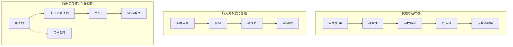

# Memory-Map · AI Backend Engineer 知识网络

> 唯一事实来源：本仓库 `docs/python/day01~day14`、`CURRICULUM.md`、`cheat_sheets/python.md`。
> 用途：建立长期记忆网络——每个知识点标注 **前置 / 后续 / 关联 / 实际应用**，用 Mermaid 呈现依赖关系。

---

## 一、总览：从 Python 到 AI Backend 的主干

主干口诀：对象是地基 → 作用域/闭包/装饰器管理行为 → 生成器/异常/上下文/异步管理数据与资源 → 类型/模块/OOP 管理结构 → Day14 收敛为分层系统。

---

## 二、知识依赖网络（非树，含横向关联）

横向关联（虚线）是「第二大脑」的关键：生成器与异常在流式失败处相遇；上下文管理器与异步在资源清理处相遇；闭包与装饰器在依赖工厂处相遇；OOP 与架构在组合/依赖注入处相遇。

---

## 三、每个知识点的四维卡片

> 格式：**前置**（学它前要会什么）· **后续**（它支撑什么）· **关联**（横向相关）· **实际应用**（AI Backend 落地）。

### Day01 · 对象模型

| 维度 | 内容 |
|------|------|
| 前置 | 无（起点） |
| 后续 | Day02 可变性、Day07 生成器、Day10 类型、Day11 OOP |
| 关联 | `==` vs `is`、函数对象 ↔ Day06 装饰器、callable ↔ Agent 工具 |
| 实际应用 | FastAPI 路由函数是对象；AI 工具注册表存函数对象；对象身份 ≠ 数据库身份 |

### Day02 · 可变 vs 不可变

| 维度 | 内容 |
|------|------|
| 前置 | Day01 名字/引用/身份 |
| 后续 | Day03 参数传递、Day07 状态不共享 |
| 关联 | 浅/深拷贝 ↔ 所有权、hashable ↔ 缓存 key |
| 实际应用 | 请求态隔离、Playwright context 隔离、会话 history 按 user 存储 |

### Day03 · 函数与参数传递

| 维度 | 内容 |
|------|------|
| 前置 | Day01 对象、Day02 可变性 |
| 后续 | Day04 作用域、Day08 异常传播 |
| 关联 | 变异 vs 重绑定 ↔ 函数边界即所有权边界 |
| 实际应用 | service 函数明确所有权，避免污染 payload / 共享 messages |

### Day04 · 作用域 LEGB

| 维度 | 内容 |
|------|------|
| 前置 | Day01、Day03 |
| 后续 | Day05 闭包、Day09 模块全局态 |
| 关联 | `global`/`nonlocal`、UnboundLocalError、晚绑定 ↔ Day05 |
| 实际应用 | Depends 依赖、请求生命周期、DB session 作用域 |

### Day05 · 闭包

| 维度 | 内容 |
|------|------|
| 前置 | Day03 函数、Day04 作用域 |
| 后续 | Day06 装饰器 |
| 关联 | 工厂函数、晚绑定 `i=i`、闭包 vs 类 ↔ Day11 |
| 实际应用 | FastAPI 依赖工厂、Playwright 超时工厂、AI prompt builder 工厂 |

### Day06 · 装饰器

| 维度 | 内容 |
|------|------|
| 前置 | Day01 函数对象、Day05 闭包 |
| 后续 | Day14 横切关注点、FastAPI 声明式路由 |
| 关联 | `functools.wraps`、`*args/**kwargs`、横切关注点 |
| 实际应用 | `@router` 路由、鉴权/日志、Playwright `@retry`、AI `@track_tokens` |

### Day07 · 迭代器与生成器

| 维度 | 内容 |
|------|------|
| 前置 | Day01 对象/协议 |
| 后续 | Day12 上下文管理器（yield）、Day13 异步流 |
| 关联 | 惰性求值、一次性消费、`yield from`、StopIteration ↔ Day08 |
| 实际应用 | FastAPI StreamingResponse、LLM token 流、逐页抓取 |

### Day08 · 异常处理

| 维度 | 内容 |
|------|------|
| 前置 | Day03 调用栈 |
| 后续 | Day12 finally 清理、Day14 错误契约 |
| 关联 | 传播、`raise from`、自定义异常、流式失败 ↔ Day07 |
| 实际应用 | FastAPI HTTPException、Playwright 截图重抛、LLM/工具错误分类 |

### Day09 · 模块与包

| 维度 | 内容 |
|------|------|
| 前置 | Day04 全局作用域 |
| 后续 | Day14 分层（包即层） |
| 关联 | `sys.modules` 缓存、导入副作用、绝对导入 |
| 实际应用 | app 分层包、llm_client 工厂、避免导入时连库/启浏览器 |

### Day10 · 类型标注

| 维度 | 内容 |
|------|------|
| 前置 | Day01 对象、Day02 集合 |
| 后续 | Day11 对象契约、Day14 接口 |
| 关联 | `User \| None`、`TypeVar`/`Generic`、非运行时检查 |
| 实际应用 | FastAPI 请求/响应模型、Pydantic 校验、OpenAPI、AI 消息契约 |

### Day11 · 面向对象

| 维度 | 内容 |
|------|------|
| 前置 | Day01 对象、Day10 类型 |
| 后续 | Day14 服务对象/依赖注入 |
| 关联 | `self`、类/实例属性、`super()`、组合 vs 继承 ↔ 闭包 vs 类 |
| 实际应用 | ChatService 组合 LLMClient/PromptBuilder/Cache，provider 可替换 |

### Day12 · 上下文管理器

| 维度 | 内容 |
|------|------|
| 前置 | Day07 生成器（yield）、Day08 try/finally |
| 后续 | Day13 异步资源清理 |
| 关联 | `__enter__/__exit__`、`@contextmanager`、多资源反序释放 |
| 实际应用 | FastAPI yield 依赖、Playwright 关 context、LLM 流/锁清理 |

### Day13 · 异步编程

| 维度 | 内容 |
|------|------|
| 前置 | Day12 资源清理、Day08 异常 |
| 后续 | Day14 并发与扩展 |
| 关联 | 事件循环、协程 vs Task、`gather`、`Semaphore`、取消 |
| 实际应用 | async 端点、并发 LLM 调用 + 限流、客户端断开取消任务 |

### Day14 · 分层架构

| 维度 | 内容 |
|------|------|
| 前置 | Day01–13 全部 |
| 后续 | 生产 AI Backend / Agent 系统 |
| 关联 | 分层、依赖注入、无状态、worker vs async、重试退避 |
| 实际应用 | Router→Service→Browser→LLM→Repository→DB，水平扩展 |

---

## 四、三条「贯穿全课」的记忆主线

- **主线1（状态与所有权）**：从「名字指向对象」一路到「无状态服务水平扩展」——核心问题始终是「谁拥有这个状态」。
- **主线2（行为封装）**：函数是对象 → 闭包捕获配置 → 装饰器加横切关注点 → 组合与依赖注入组装系统。
- **主线3（数据与资源）**：生成器管数据流 → 上下文管理器管资源释放 → 异步管并发等待 → 限流退避保护下游；异常处理贯穿全程。

---

## 五、一句话串联记忆

> 一切皆**对象**，变量是**引用**；可变对象要管**所有权**；函数按**共享**传参；名字按 **LEGB** 查；**闭包**捕获配置，**装饰器**加横切；**生成器**是一次性数据流，**异常**是生产控制流，**上下文管理器**保证释放，**异步**重叠 I/O 等待；**类型**是契约、**模块**是边界、**OOP**是职责；最终在 **Day14 分层架构**里收敛成可扩展的 AI Backend。
