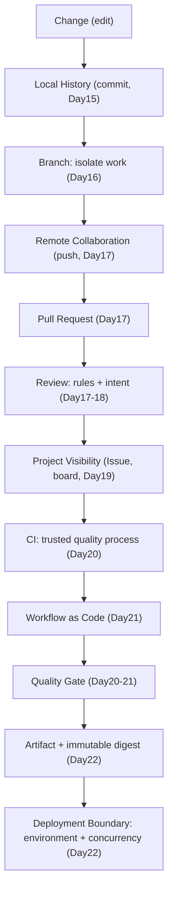
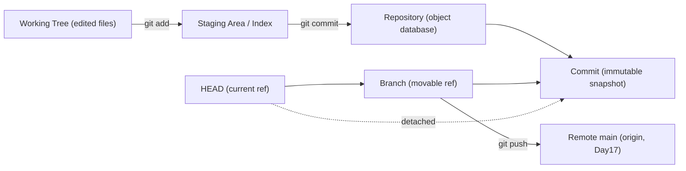
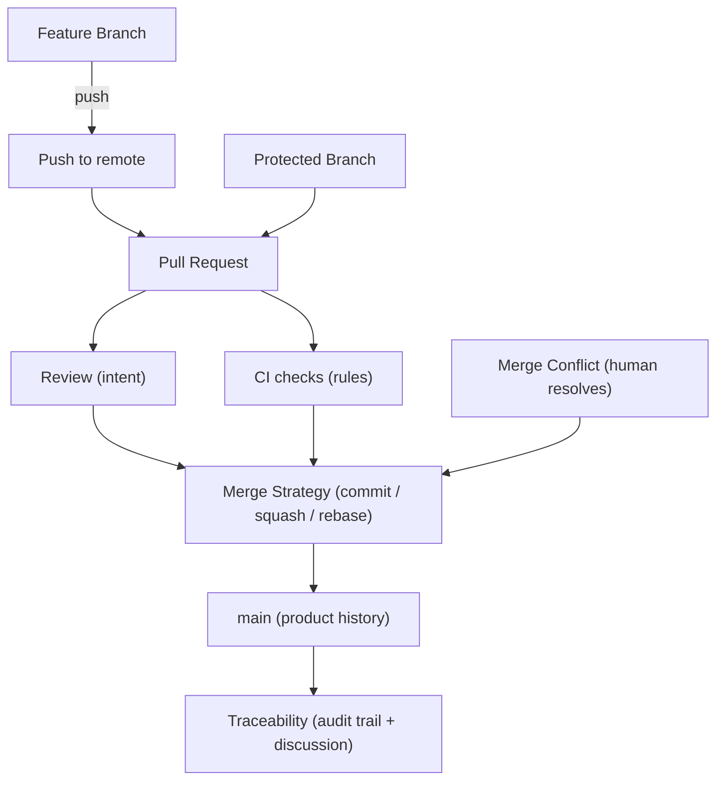
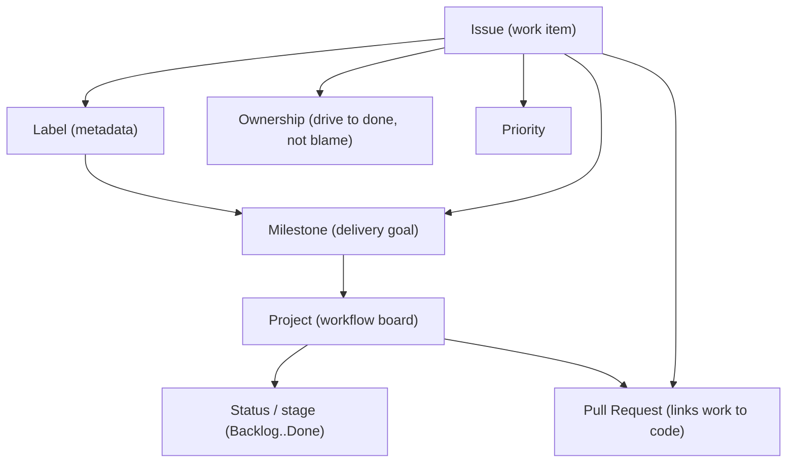
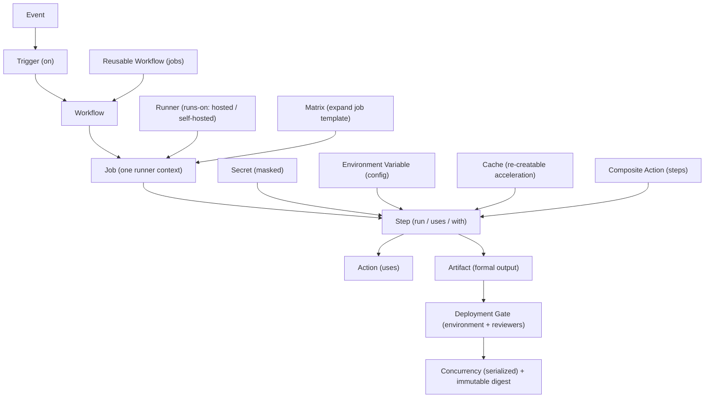
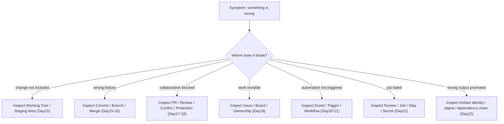

# Day15–Day22 Engineering Knowledge Network

> Part of the **Day15–Day22 Engineering Foundations Second Brain**.
> Companion documents: [super-cheatsheet.md](super-cheatsheet.md) · [code-templates.md](code-templates.md) · [interview-qa.md](interview-qa.md) · [one-page.md](one-page.md)

This is the **connection** layer of the Second Brain. Where [super-cheatsheet.md](super-cheatsheet.md) *explains* each concept, this file shows how the concepts *link* into one delivery system. Read the diagrams to recover structure; read the cheat sheet to recover meaning.

All nodes and edges below are drawn only from Day15–Day22 lessons. Anything the repository did not teach is omitted rather than invented.

> **Rendering note:** the Mermaid below uses only GitHub-supported basic `flowchart` / `graph` syntax; labels containing spaces or punctuation are quoted, and node IDs are unique. Mermaid syntax was reviewed statically; rendering was not executed.

---

## 1. Software Delivery Main Chain

The backbone of Phase 2: one change flowing from a local edit to a protected deployment boundary.



*Reading method:* follow top to bottom. Each node is a capability the previous lesson lacked; the gate decides what may reach the deployment boundary.

---

## 2. Git State Network (Day15–Day16)

How the three trees and references relate. Commands are edges that move data between states.



*Reading method:* solid edges are commands moving data; `HEAD -> branch -> commit` is the normal chain; the dotted edge is detached HEAD pointing straight at a commit.

---

## 3. Collaboration & Integration Network (Day16–Day18)

How isolated work becomes trusted, traceable integration on a shared line.



*Reading method:* a PR is the hub; protection forces work through it; both review and CI feed the merge-strategy choice; the result on `main` leaves a traceable record.

---

## 4. Work Management Network (Day19)

How work is described, grouped, owned, and moved — layered on top of the code pipeline.



*Reading method:* an Issue is the unit; label/owner/priority describe it; milestones group Issues into a goal; the Project board shows each Issue's stage and links to its PR.

---

## 5. CI/CD Execution Network (Day20–Day22)

The full GitHub Actions execution model, from event to protected deployment.



*Reading method:* event triggers a workflow of jobs on a runner; matrix expands the job; steps use actions, secrets, env, and cache; artifacts and the gate control what deploys.

---

## 6. Failure Reasoning Map

When something is wrong, this map tells you *which layer to inspect first*. Each branch is grounded in Day15–Day22.



*Reading method:* start at the symptom, pick the branch that matches, and inspect that single layer before touching others — most delivery bugs live in exactly one layer.

---

## How the Six Networks Connect

```text
Git State (2)  ->  Collaboration (3)  ->  Work Management (4) sits on top
                                   |
                                   v
                        Main Delivery Chain (1)
                                   |
                                   v
                        CI/CD Execution (5)
                                   |
                        Failure Reasoning (6) indexes all layers
```

Diagram 1 is the spine; diagrams 2–5 zoom into each region of that spine; diagram 6 is the reverse index used when debugging.

---

# Source Map

| Diagram | Repository Source |
|---|---|
| 1. Software Delivery Main Chain | `docs/devops/day20-ci-cd-foundations.md`, `docs/github/day19-project-management.md` |
| 2. Git State Network | `docs/git/day15-git-fundamentals.md`, `docs/git/day16-branch-and-merge.md` |
| 3. Collaboration & Integration | `docs/git/day16-branch-and-merge.md`, `docs/git/day17-github-workflow.md`, `docs/git/day18-merge-strategy-and-code-review.md` |
| 4. Work Management | `docs/github/day19-project-management.md` |
| 5. CI/CD Execution | `docs/devops/day21-github-actions-fundamentals.md`, `docs/devops/day22-github-actions-advanced.md` |
| 6. Failure Reasoning Map | `docs/git/day15-git-fundamentals.md`, `docs/git/day17-github-workflow.md`, `docs/devops/day21-github-actions-fundamentals.md`, `docs/devops/day22-github-actions-advanced.md` |
