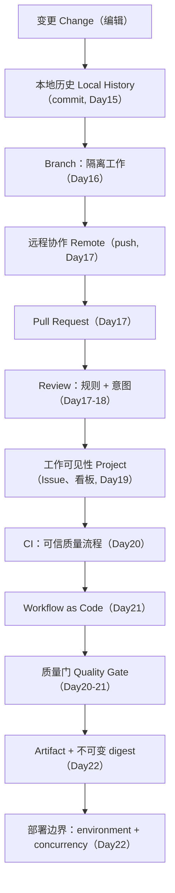
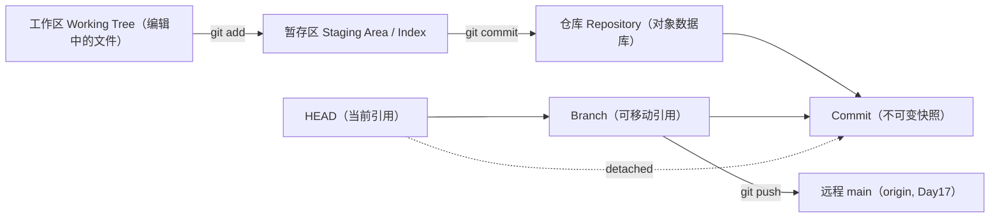
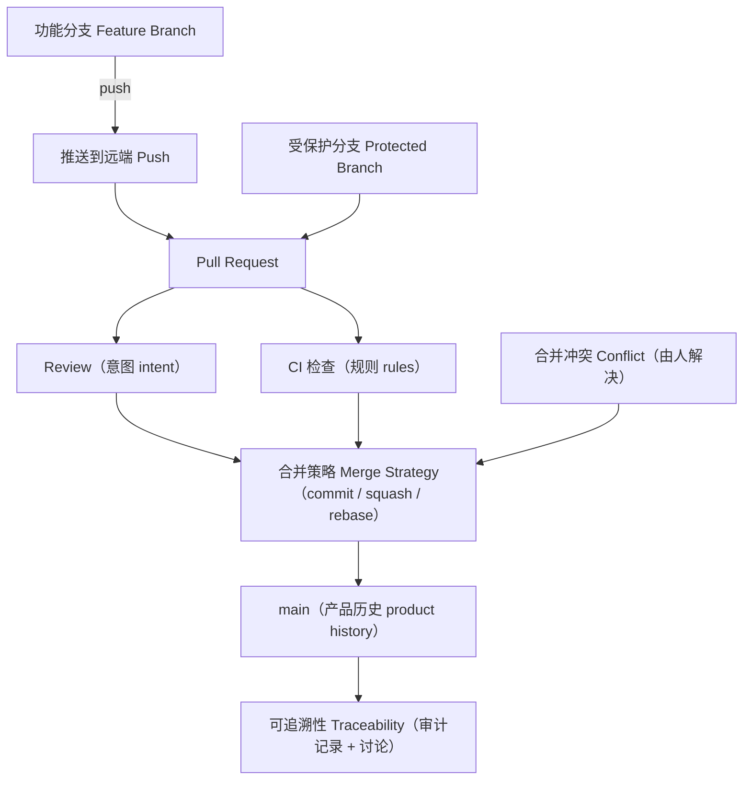
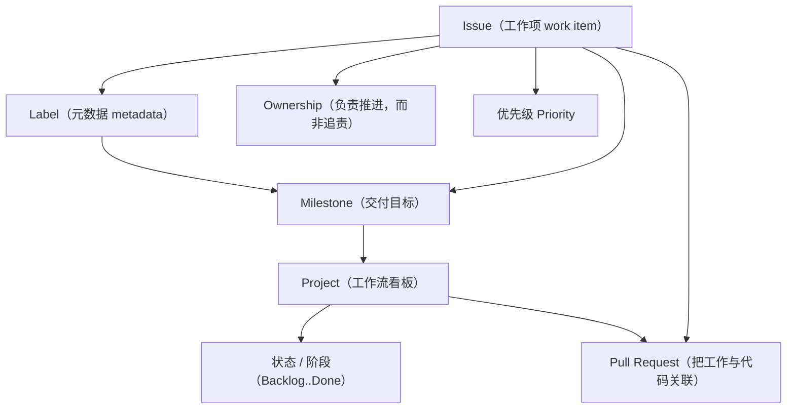
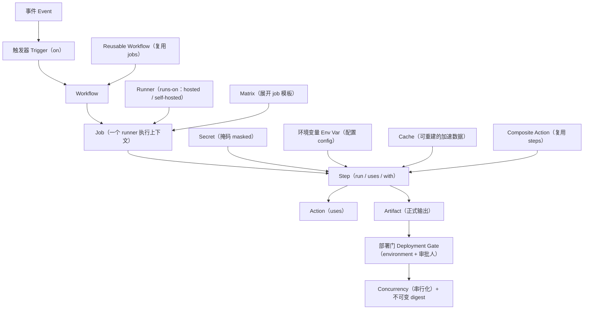
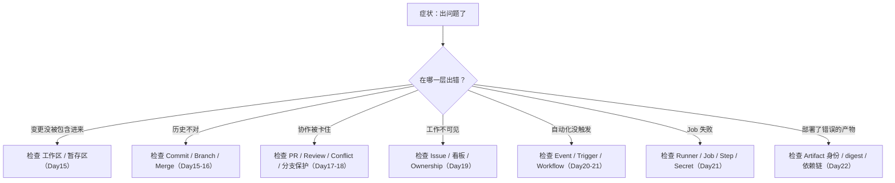

# Day15–Day22 工程知识网络（中文版）

> 属于 **Day15–Day22 工程基础 Second Brain**。
> 英文原版：[memory-map.md](memory-map.md)
> 配套文档：[super-cheatsheet.md](super-cheatsheet.md) · [code-templates.md](code-templates.md) · [interview-qa.md](interview-qa.md) · [one-page.md](one-page.md)

这是 Second Brain 的**连接层**。[super-cheatsheet.md](super-cheatsheet.md) 负责*解释*每个概念，本文负责展示这些概念如何*连接*成一个完整的软件交付系统。看图恢复结构，看 cheat sheet 恢复含义。

下面所有节点和连线都只来自 Day15–Day22 的课程内容。仓库没有教过的内容一律省略，不臆造。

> **渲染说明：** 下面的 Mermaid 只使用 GitHub 支持的基础 `flowchart` / `graph` 语法；含空格或标点的标签都已加引号，节点 ID 唯一。Mermaid 语法只做了静态检查，未实际运行渲染器。

---

## 1. 软件交付主链

Phase 2 的骨架：一次变更从本地编辑一路流向受保护的部署边界。



*阅读方法：* 从上往下看。每个节点都是上一课还不具备的能力；质量门决定什么才允许抵达部署边界。

---

## 2. Git 状态网络（Day15–Day16）

三棵树与引用之间的关系。命令是把数据在这些状态之间搬动的连线。



*阅读方法：* 实线是搬动数据的命令；`HEAD -> branch -> commit` 是正常链条；虚线是 detached HEAD，HEAD 直接指向某个 commit。

---

## 3. 协作与集成网络（Day16–Day18）

孤立的工作如何变成可信、可追溯的集成，进入共享分支。



*阅读方法：* PR 是枢纽；分支保护强制所有工作经过它；Review 和 CI 都汇入合并策略的选择；落到 `main` 上的结果留下可追溯的记录。

---

## 4. 工作管理网络（Day19）

工作如何被描述、分组、归属、推进——叠加在代码流水线之上。



*阅读方法：* Issue 是工作单元；label / owner / priority 描述它；milestone 把 Issue 聚成一个目标；Project 看板显示每个 Issue 的阶段并链接到对应 PR。

---

## 5. CI/CD 执行网络（Day20–Day22）

完整的 GitHub Actions 执行模型，从事件到受保护部署。



*阅读方法：* 事件触发一个由多个 job 组成的 workflow，运行在 runner 上；matrix 展开 job；step 使用 action、secret、env、cache;artifact 和部署门决定什么会被部署。

---

## 6. 故障排查地图（Failure Reasoning Map）

出问题时，这张图告诉你*先检查哪一层*。每个分支都来自 Day15–Day22。



*阅读方法：* 从症状出发，选匹配的分支，先只检查那一层再动别处——大多数交付问题都恰好只在一层里。

---

## 六张网络如何相互连接

```text
Git 状态 (2)  ->  协作 (3)  ->  工作管理 (4) 叠加在上层
                              |
                              v
                     软件交付主链 (1)
                              |
                              v
                     CI/CD 执行 (5)
                              |
                 故障排查 (6) 为所有层建立反向索引
```

图 1 是主干；图 2–5 分别放大主干的每个区域；图 6 是排障时用的反向索引。

---

# Source Map（来源对照）

| 图 | 仓库来源 |
|---|---|
| 1. 软件交付主链 | `docs/devops/day20-ci-cd-foundations.md`、`docs/github/day19-project-management.md` |
| 2. Git 状态网络 | `docs/git/day15-git-fundamentals.md`、`docs/git/day16-branch-and-merge.md` |
| 3. 协作与集成 | `docs/git/day16-branch-and-merge.md`、`docs/git/day17-github-workflow.md`、`docs/git/day18-merge-strategy-and-code-review.md` |
| 4. 工作管理 | `docs/github/day19-project-management.md` |
| 5. CI/CD 执行 | `docs/devops/day21-github-actions-fundamentals.md`、`docs/devops/day22-github-actions-advanced.md` |
| 6. 故障排查地图 | `docs/git/day15-git-fundamentals.md`、`docs/git/day17-github-workflow.md`、`docs/devops/day21-github-actions-fundamentals.md`、`docs/devops/day22-github-actions-advanced.md` |
