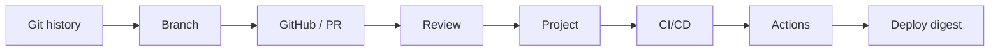

# Day15–Day22 One-Page Review

> 5-minute recall. Deeper: [super-cheatsheet.md](super-cheatsheet.md) · [memory-map.md](memory-map.md) · [code-templates.md](code-templates.md) · [interview-qa.md](interview-qa.md)

**Whole-stage sentence:** delivery = letting one change enter the target environment in a way that is *traceable, reviewable, verifiable, reproducible, recoverable*.

## Software Delivery Chain



Git tracks history → branches isolate → GitHub collaborates → PR/review gate → project makes work visible → CI/CD automates quality → Actions is pipeline-as-code → advanced Actions deploy a verified digest.

## Git State Model (Day15–16)
- `Working Tree --add--> Index --commit--> Repository`; commit builds from the **Index**.
- Commit = immutable snapshot (content hash). Branch = movable reference. HEAD = current reference.
- Snapshot, not diff (reuses unchanged objects). Detached HEAD = HEAD points straight at a commit.
- `reset`: `--soft` (ref) / `--mixed` (+Index) / `--hard` (+Working Tree, destructive). `reflog` recovers committed work only.

## Collaboration Model (Day17–18)
- `main` = shared state; never push directly. PR = Review + CI + Discussion + Audit.
- Machines validate **rules**; humans validate **intent**. Branch protection makes the safe path the only path.
- Merge: fast-forward (linear) / three-way (2 parents) / conflict (Git refuses to guess intent).
- Strategy: merge commit (keep steps) / squash (one product commit) / rebase (linear, rewrites identity — not on shared history).

## Project Management Model (Day19)
- Issue = work item (not just bugs). Label = metadata (retrieval/workflow/automation). Milestone = delivery goal. Project = workflow board.
- Hierarchy: Issue → Label → Milestone → Project. Ownership = drive-to-done, not blame. Untracked work does not exist.

## CI/CD Model (Day20)
- "Works on my machine" = one machine/moment. CI = trusted repeatable process.
- Pipeline = standard stages + dependency + fail-fast + fast feedback. Quality gate = risk control (block, not report).
- **Delivery = always *ready*** (approval optional). **Deployment = auto-ship once gates pass.** Workflow/Everything as Code.

## GitHub Actions Execution Model (Day21)
- `Event → on(trigger) → Workflow → Runner(runs-on) → Job → Step(run/uses/with) → Gate → Build → Deploy`.
- `on` = when; `runs-on` = where. `run` = shell; `uses` = action; `with` = args.
- Job = one runner context (fresh on hosted; may persist on self-hosted). Checkout initializes the empty runner.
- Hosted vs self-hosted = **control, not speed**; more control ≠ safer. Build waits for the gate.

## Cache vs Artifact (Day22)
- **Cache** = re-creatable acceleration (OS + dep-hash key); must be correct on a miss. E.g. pip, Chromium.
- **Artifact** = this run's official output; transfers between jobs (jobs share no filesystem). E.g. coverage.xml, reports.
- Never use a cache as the result store.

## Reuse Boundaries (Day22)
- **Composite Action** = reusable **steps** (no `jobs`/`runs-on`; runs in caller job).
- **Reusable Workflow** = reusable **jobs** (owns `jobs`/`runs-on`/`needs`; `workflow_call`; must sit directly in `.github/workflows/`).
- Matrix = one template → N isolated jobs (not resource saving). `fail-fast` by value of remaining combinations.
- `needs` (order) vs `if` (decision) vs `continue-on-error` (tolerance) — three separate mechanisms.

## Security Boundaries
- `env` = plain visible config; `${{ secrets.NAME }}` = encrypted + masked. Never hardcode/print secrets; scope to the step.
- Fork PRs get no repository secrets by default. Self-hosted runner = internal blast radius; keep ephemeral/isolated/least-privilege.
- Pin actions: `@v4` (movable) vs full commit SHA (immutable, for third-party/high-security).
- Deploy the immutable digest (`@sha256:...`), never `:latest`; production Secrets only in the deploy job.

## Failure Diagnosis (which layer to inspect)
- Change not included → Working Tree / Staging.
- Wrong history → Commit / Branch / Merge.
- Collaboration blocked → PR / Review / Conflict / Protection.
- Work invisible → Issue / Board / Ownership.
- Automation not triggered → Event / Trigger / Workflow.
- Job failed → Runner / Job / Step / Secret.
- Wrong output promoted → Artifact identity / digest / dependency chain.

## Mental Model Evolution
```text
Git = backup -> Git = objects + refs + immutable history
Branch = copy -> Branch = movable reference; merge integrates, conflict keeps humans in charge
Push to main -> main is shared state; PR is a gate (rules + intent + audit)
Issue = bug -> Issue = work item; Project shows where work is
"Works locally" -> CI is a process; Delivery (ready) != Deployment (live)
Actions runs my tests -> process-as-code; job = one runner context; on=when, runs-on=where
Matrix saves resources -> matrix = N isolated jobs; composite=steps, reusable=jobs; deploy the exact digest
```

## Knowledge Boundary
Learned: Git → GitHub → project management → CI/CD → GitHub Actions (basic + advanced). **Next (Day23 Docker):** the container/image model the deployed digests represent — not covered here.

## Ten Questions I Must Be Able to Answer
1. Why is Git a snapshot model, not a pure diff?
2. What is the difference between HEAD and a branch (and detached HEAD)?
3. Fast-forward vs three-way merge — and why does a conflict stop Git?
4. Why is a direct push to `main` dangerous, and what does a PR bundle?
5. Squash vs merge commit vs rebase — when and what does rebase rewrite?
6. Issue vs Project — what does each answer?
7. Continuous Delivery vs Continuous Deployment?
8. `on` vs `runs-on`, and `run` vs `uses` vs `with`?
9. Cache vs artifact, and composite action vs reusable workflow?
10. Why "build once, deploy many" with an immutable digest, not `:latest`?

---

**Source Map**

| Section | Source |
|---|---|
| Git / Collaboration | `docs/git/day15-git-fundamentals.md` … `docs/git/day18-merge-strategy-and-code-review.md` |
| Project Management | `docs/github/day19-project-management.md` |
| CI/CD + Actions | `docs/devops/day20-ci-cd-foundations.md`, `docs/devops/day21-github-actions-fundamentals.md`, `docs/devops/day22-github-actions-advanced.md` |
| Boundary (Day23) | `CURRICULUM.md`, `ROADMAP.md` |
