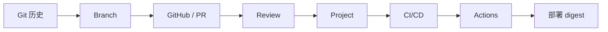

# Day15–Day22 一页速览（中文版）

> 5 分钟快速回忆。英文原版:[one-page.md](one-page.md) ｜ 深入:[super-cheatsheet.md](super-cheatsheet.md) · [memory-map.zh.md](memory-map.zh.md) · [code-templates.md](code-templates.md) · [interview-qa.md](interview-qa.md)

**全阶段一句话:** 交付 = 让一次变更以*可追踪、可审查、可验证、可复现、可恢复*的方式进入目标环境。

## 软件交付主链



Git 记录历史 → Branch 隔离 → GitHub 协作 → PR/Review 把关 → Project 让工作可见 → CI/CD 自动化质量 → Actions 把流水线写成代码 → 高级 Actions 部署经过验证的 digest。

## Git 状态模型(Day15–16)
- `工作区 --add--> 暂存区(Index) --commit--> 仓库`;commit 是从 **Index** 构建的。
- Commit = 不可变快照(内容哈希)。Branch = 可移动引用。HEAD = 当前引用。
- 快照,不是 diff(复用未改动对象)。Detached HEAD = HEAD 直接指向某个 commit。
- `reset`:`--soft`(动引用)/`--mixed`(+Index)/`--hard`(+工作区,破坏性)。`reflog` 只能恢复已提交的工作。

## 协作模型(Day17–18)
- `main` = 共享状态,不要直接 push。PR = Review + CI + 讨论 + 审计记录。
- 机器验证**规则**;人验证**意图**。分支保护让安全路径成为唯一路径。
- 合并:fast-forward(线性)/ three-way(两个父)/ 冲突(Git 拒绝猜意图)。
- 策略:merge commit(保留步骤)/ squash(一个产品提交)/ rebase(线性,但重写身份——不用于共享历史)。

## 项目管理模型(Day19)
- Issue = 工作项(不只是 bug)。Label = 元数据(检索/流程/自动化)。Milestone = 交付目标。Project = 工作流看板。
- 层级:Issue → Label → Milestone → Project。Ownership = 负责推进,而非追责。没被追踪的工作等于不存在。

## CI/CD 模型(Day20)
- "在我机器上能跑" = 单机、单时刻。CI = 可信、可重复的流程。
- 流水线 = 标准阶段 + 阶段依赖 + fail-fast + 快速反馈。质量门 = 风险控制(拦截,而非只报告)。
- **Delivery = 始终*准备好*发布**(审批可选)。**Deployment = 门通过后自动上线**。Workflow / Everything as Code。

## GitHub Actions 执行模型(Day21)
- `Event → on(触发) → Workflow → Runner(runs-on) → Job → Step(run/uses/with) → 质量门 → Build → Deploy`。
- `on` = 何时;`runs-on` = 何处。`run` = shell;`uses` = action;`with` = 参数。
- Job = 一个 runner 执行上下文(hosted 上全新;self-hosted 可能残留)。Checkout 初始化空 runner。
- Hosted vs self-hosted = **控制,而非速度**;控制更多 ≠ 更安全。Build 要等质量门。

## Cache vs Artifact(Day22)
- **Cache** = 可重建的加速数据(键 = OS + 依赖哈希);miss 时也必须正确。如 pip、Chromium。
- **Artifact** = 本次运行的正式输出;在 job 间传递(job 之间不共享文件系统)。如 coverage.xml、报告。
- 绝不能把 cache 当作结果的正式存储。

## 复用边界(Day22)
- **Composite Action** = 复用 **steps**(无 `jobs`/`runs-on`;在调用方 job 内运行)。
- **Reusable Workflow** = 复用 **jobs**(拥有 `jobs`/`runs-on`/`needs`;`workflow_call`;必须直接放在 `.github/workflows/`)。
- Matrix = 一个模板 → N 个隔离 job(不是省资源)。`fail-fast` 由剩余组合是否仍有独立价值决定。
- `needs`(顺序)vs `if`(决策)vs `continue-on-error`(容错)——三种独立机制。

## 安全边界
- `env` = 明文可见配置;`${{ secrets.NAME }}` = 加密 + 掩码。绝不硬编码/打印 secret;按 step 最小授权。
- Fork PR 默认拿不到仓库 secret。Self-hosted runner = 内网爆炸半径,要保持临时化/隔离/最小权限。
- Action 固定版本:`@v4`(可移动)vs 完整 commit SHA(不可变,用于第三方/高安全)。
- 部署不可变 digest(`@sha256:...`),绝不用 `:latest`;生产 secret 只在部署 job 里。

## 故障定位(该查哪一层)
- 变更没被包含 → 工作区 / 暂存区。
- 历史不对 → Commit / Branch / Merge。
- 协作被卡住 → PR / Review / 冲突 / 分支保护。
- 工作不可见 → Issue / 看板 / Ownership。
- 自动化没触发 → Event / Trigger / Workflow。
- Job 失败 → Runner / Job / Step / Secret。
- 部署了错误产物 → Artifact 身份 / digest / 依赖链。

## 心智模型演化
```text
Git = 备份 -> Git = 对象 + 引用 + 不可变历史
Branch = 复制 -> Branch = 可移动引用;merge 集成,冲突让人把关
直接 push main -> main 是共享状态;PR 是一道门(规则 + 意图 + 审计)
Issue = bug -> Issue = 工作项;Project 显示工作在哪
"本地能跑" -> CI 是流程;Delivery(准备好)!= Deployment(已上线)
Actions 只是跑测试 -> 流程即代码;job = 一个 runner 上下文;on=何时, runs-on=何处
Matrix 省资源 -> matrix = N 个隔离 job;composite=steps, reusable=jobs;部署那个确切的 digest
```

## 知识边界
已学:Git → GitHub → 项目管理 → CI/CD → GitHub Actions(基础 + 高级)。**下一步(Day23 Docker):** 被部署的 digest 所代表的容器/镜像模型——本阶段不涉及。

## 我必须答得出的十个问题
1. 为什么 Git 是快照模型,而不是纯 diff?
2. HEAD 和 branch 有什么区别(以及 detached HEAD)?
3. Fast-forward vs three-way merge——冲突为什么会让 Git 停下?
4. 为什么直接 push 到 `main` 危险,PR 打包了哪四样东西?
5. Squash vs merge commit vs rebase——各自何时用,rebase 重写了什么?
6. Issue vs Project——各自回答什么问题?
7. Continuous Delivery vs Continuous Deployment?
8. `on` vs `runs-on`,以及 `run` vs `uses` vs `with`?
9. Cache vs artifact,以及 composite action vs reusable workflow?
10. 为什么"构建一次、多处部署",用不可变 digest 而非 `:latest`?

---

**Source Map(来源对照)**

| 部分 | 来源 |
|---|---|
| Git / 协作 | `docs/git/day15-git-fundamentals.md` … `docs/git/day18-merge-strategy-and-code-review.md` |
| 项目管理 | `docs/github/day19-project-management.md` |
| CI/CD + Actions | `docs/devops/day20-ci-cd-foundations.md`、`docs/devops/day21-github-actions-fundamentals.md`、`docs/devops/day22-github-actions-advanced.md` |
| 边界(Day23) | `CURRICULUM.md`、`ROADMAP.md` |
