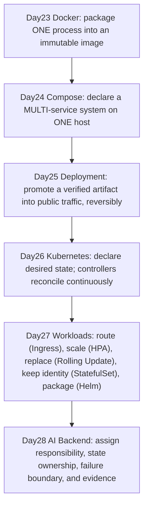
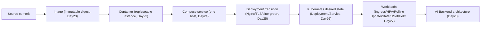
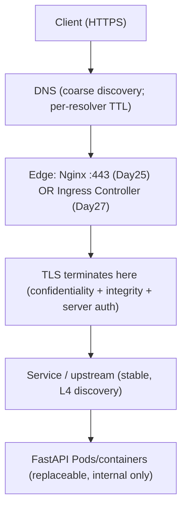
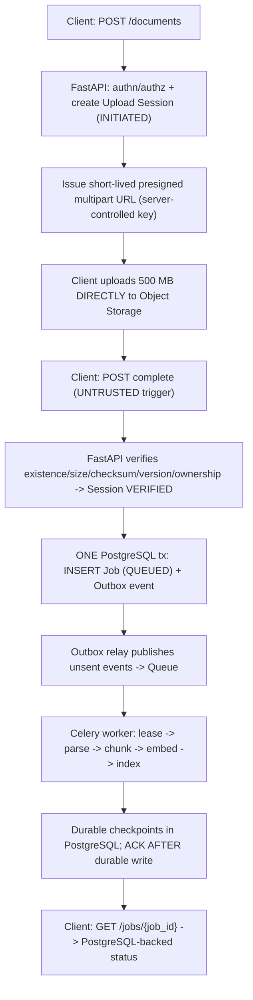
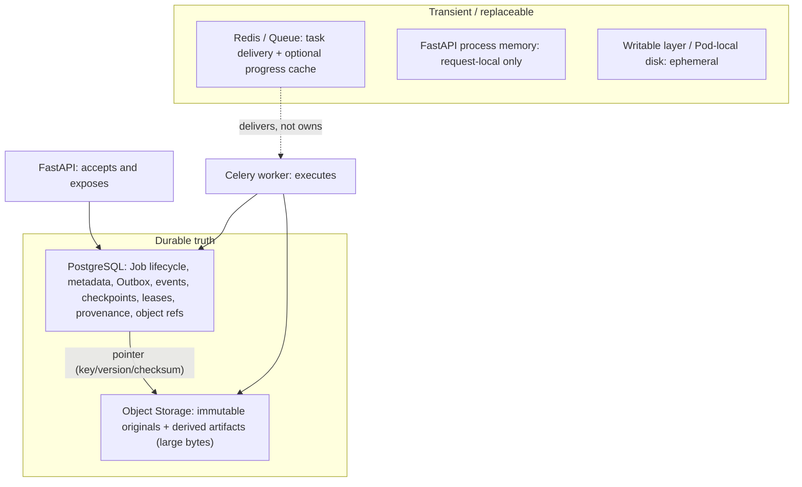
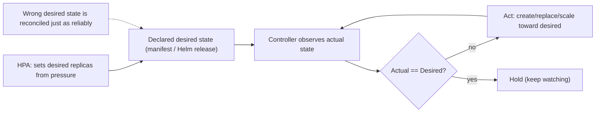
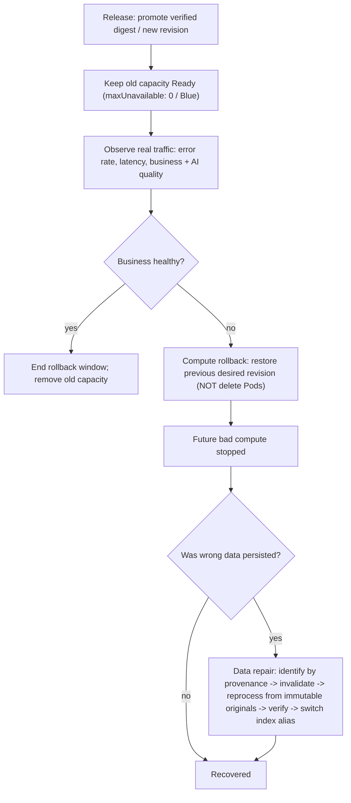
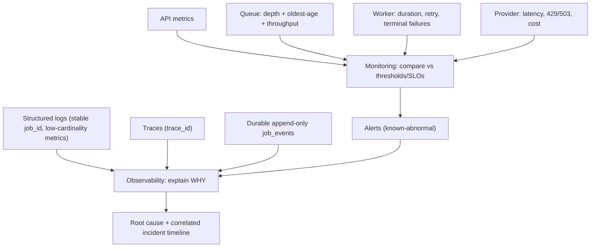

# Day23–Day28 Architecture & Failure Map

> Part of the **Production Engineering Second Brain**. See [README.md](README.md).
> Companion docs: [Super Cheat Sheet](Day23-Day28-Production-Super-CheatSheet.md) · [Artifact Templates](Day23-Day28-Artifact-Templates.md) · [Interview Q&A](Day23-Day28-Interview-QA.md) · [One Page](Day23-Day28-OnePage.md)

This is the **connection** layer: how Day23–Day28 concepts link into one production system, and where to look when it breaks. The [Super Cheat Sheet](Day23-Day28-Production-Super-CheatSheet.md) *explains* each concept; this file *connects* them and adds a unified Failure Matrix.

Every node, edge, and failure row is drawn only from Day23–Day28 lessons and their example artifacts. Nothing the repository did not teach is added.

> **Rendering note:** the Mermaid below uses only GitHub-supported basic `flowchart` / `graph` / `stateDiagram-v2` syntax; labels with spaces or punctuation are quoted, and node IDs are unique per diagram. Mermaid syntax was reviewed statically; rendering was not executed.

---

## 1. Day23 → Day28 Capability Evolution

Each stage adds the capability the previous stage lacked.



*Reading method:* top to bottom is the phase timeline. Each arrow means "the previous capability existed but was insufficient for production," so the next lesson exists.

---

## 2. Source → Image → Container → Compose → Deployment → Kubernetes → AI Backend

The artifact-identity spine: how one immutable artifact flows from source to an operated system.



*Reading method:* the same verified digest is promoted, never rebuilt per environment; runtime differences live in configuration (Compose spec / ConfigMap / Helm Values), so tested = deployed all the way to the operated AI backend.

---

## 3. Public Request Path (Day25 + Day27)

How an external request reaches the application.



*Reading method:* the public contract (domain/URL/TLS) is stable at the edge; the backend behind it is replaceable. `localhost` never crosses this boundary — internal hops use service DNS.

---

## 4. 500 MB Upload + Async Job Flow (Day28)

The accept-fast / process-async design for a large document.



*Reading method:* FastAPI accepts and commits; the worker executes. Bytes bypass the API (data plane = Object Storage); truth is the PostgreSQL Job + Outbox (control plane). Delivery is at-least-once, so effects must be idempotent.

---

## 5. State / Data Ownership Map (Day23–Day28)

Who owns each piece of truth. Ownership is the core production judgment.



*Reading method:* everything in "transient" must be reconstructable from "durable truth." Redis delivers and accelerates but is never the source of truth; PostgreSQL holds the pointer, Object Storage holds the bytes.

Per-component ownership:

| Component | Owns | Does NOT own | Failure mode | Recovery method | Evidence |
|---|---|---|---|---|---|
| FastAPI | request/control plane, `202 + job_id`, presigned URL, verification | durable Job truth, long execution | timeout if it does long work; Pod replaced | keep it stateless; read truth from PostgreSQL | request rate, error rate, latency |
| Celery worker | task execution, checkpoints, ACK timing | Job source of truth, delivery guarantee | crash after external success, before ACK | lease + idempotency key + ACK after durable write | task duration, retry rate, terminal failures |
| Redis / Queue | task transport, optional cache | durable business truth | broker loss / redelivery | at-least-once + idempotent consumers; reconcile | queue depth, oldest age, enqueue/dequeue rate |
| PostgreSQL | durable Job truth, Outbox, events, unique constraints | large bytes, execution | DB-to-queue crash gap | Transactional Outbox + reconciliation scanner | job state, event history, stuck-by-stage |
| Object Storage | large immutable/derived bytes | authorization, job state | incomplete/interrupted upload | multipart + retry + cleanup; verify before Job | object existence/size/checksum |
| Monitoring | detection of known signals | root cause, correctness proof | alert fatigue / false positives | tie thresholds to SLOs; correlate signals | metrics vs thresholds |
| Observability | explanation via correlation | prevention | high-cardinality blow-up | stable `job_id`, low-cardinality metrics | logs + traces + durable events |

---

## 6. Desired State and Reconciliation Loop (Day26 + Day27)

The control loop that continuously maintains declared state.



*Reading method:* the loop enforces the declaration, not correctness. HPA changes the *desired* replica count (it does not create Pods directly). A bad desired state (e.g. a wrong Secret) is amplified across replicas — control the declaration during an incident before letting the controller act.

---

## 7. Release / Observe / Rollback / Data Repair Flow (Day25–Day28)

The safe release lifecycle, including the half that rollback cannot fix.



*Reading method:* `Compute rollback stops future damage; data repair corrects damage already persisted.` Readiness 200 is not business success, so observe business/AI signals before finishing. Rolling back the declaration ≠ deleting Pods (the controller recreates them).

---

## 8. Monitoring & Observability Evidence Flow (Day28)

How signals become detection and explanation.



*Reading method:* monitoring answers "is a known signal abnormal?"; observability answers "why?" by correlating on stable `job_id` across components. Interpret queue signals together: depth+age rising & throughput ~0 = stall; & throughput normal = under capacity; depth high & age low = burst.

---

## Unified Failure Matrix

Each row is a failure discussed in Day23–Day28. "Inspect first" points to the layer that owns the fault; recovery uses only mechanisms the lessons taught.

| # | Failure | Inspect first | Root cause (as taught) | Recovery (as taught) | Day |
|---|---|---|---|---|---|
| 1 | Container dies | Container process / cgroup | crash or resource limit hit | controller/operator replaces it; durable state is in a volume/external store, not the writable layer | 23/26 |
| 2 | Compose dependency starts but is not ready | `depends_on` / healthcheck / app retry | container "started" ≠ "ready" | `depends_on: condition: service_healthy` + real healthcheck + bounded application retry | 24 |
| 3 | Nginx or TLS failure | Edge (Nginx :443 / cert) | expired cert invalidates identity (outage, not plaintext); bad config | renew before expiry, `nginx -t && nginx -s reload`; verify served cert externally | 25 |
| 4 | Bad application release | Blue-Green / Rolling Update | v2 broken; readiness 200 ≠ business success | switch traffic back to Blue / restore previous revision; observe real traffic; drain | 25/27 |
| 5 | Bad ConfigMap / Secret | ConfigMap / Secret + Pod replacement | config updated ≠ running process env changed | fix the object, then replace Pods; verify new value is read | 26 |
| 6 | Wrong Kubernetes desired state | Declared manifest / desired state | reconciliation enforces a wrong declaration across replicas | correct the desired state first, then let controlled replacement heal | 26 |
| 7 | HPA uses the wrong metric | HPA metric + metrics pipeline | CPU stays low while an external-wait queue grows | scale on queue backlog / backlog-per-worker on the consumer, cap max replicas | 27 |
| 8 | Celery task redelivery | Queue delivery + worker idempotency | at-least-once delivery / retry | idempotency key + DB unique constraint + upsert; ACK after durable write | 28 |
| 9 | Database-to-queue crash gap | PostgreSQL Outbox + relay | crash between DB commit and publish leaves QUEUED with no message | Transactional Outbox + relay; reconciliation scanner for stale QUEUED | 28 |
| 10 | Worker crashes after provider success | Checkpoint / lease + provider idempotency | external call succeeded before local checkpoint write | durable checkpoint before ACK; provider idempotency key; reconcile dual-write gap | 28 |
| 11 | Redis unavailable | Queue / cache boundary | broker/cache is transient, not durable truth | truth is in PostgreSQL; reconstruct delivery; jobs recoverable from durable state | 24/28 |
| 12 | PostgreSQL unavailable | Durable-truth store | single StatefulSet ≠ HA (no replication/failover) | needs an operator/managed service with WAL replication + failover + fencing + backups/PITR | 27/28 |
| 13 | Object upload incomplete | Upload Session + Object Storage | client interruption; direct upload does not remove network failure | multipart + retry + cleanup; verify before creating the Job; EXPIRED session cleanup | 28 |
| 14 | Wrong embedding model writes bad indexes | Provenance + vector/index layer | semantic failure that still passes readiness | contain → restore compute → identify by provenance → reprocess from originals → verify → alias switch | 28 |
| 15 | Compute rollback succeeds but persisted data is still wrong | Data-repair boundary | compute rollback cannot fix persisted state/artifacts/indexes | data repair: invalidate/reprocess/verify/versioned rebuild + alias switch; compensate external effects | 28 |

---

## How the eight diagrams connect

```text
Capability evolution (1) is the timeline.
Artifact spine (2) is what flows through it.
Request path (3) and Upload+Job flow (4) are the two runtime paths.
Ownership map (5) says who holds truth on those paths.
Reconciliation loop (6) maintains the declared state.
Release/rollback/repair (7) changes it safely.
Evidence flow (8) proves what actually happened.
The Failure Matrix is the reverse index used when any of these breaks.
```

---

# Source Map

| Diagram / section | Repository Source |
|---|---|
| 1. Capability evolution | `docs/devops/day23-...` … `docs/devops/day28-...`, `ROADMAP.md` |
| 2. Artifact spine | `docs/devops/day23-docker-fundamentals.md`, `docs/devops/day25-deployment-foundations.md` |
| 3. Public request path | `docs/devops/day25-deployment-foundations.md`, `docs/devops/day27-kubernetes-workloads.md` |
| 4. Upload + async job flow | `docs/devops/day28-ai-backend-production-architecture.md`, `examples/ai-backend-architecture/README.md` |
| 5. State/data ownership | `docs/devops/day28-...`, `examples/ai-backend-architecture/README.md`, `docs/devops/day23-...`, `docs/devops/day24-...` |
| 6. Reconciliation loop | `docs/devops/day26-kubernetes-foundations.md`, `docs/devops/day27-kubernetes-workloads.md` |
| 7. Release/rollback/data-repair | `docs/devops/day25-...`, `docs/devops/day27-...`, `docs/devops/day28-...` |
| 8. Monitoring & observability | `docs/devops/day28-...`, `examples/ai-backend-architecture/README.md` |
| Failure Matrix | `docs/devops/day23-...` through `docs/devops/day28-...` |
