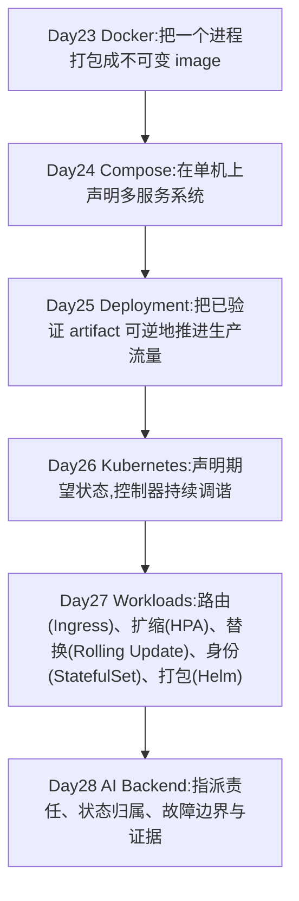
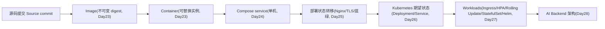
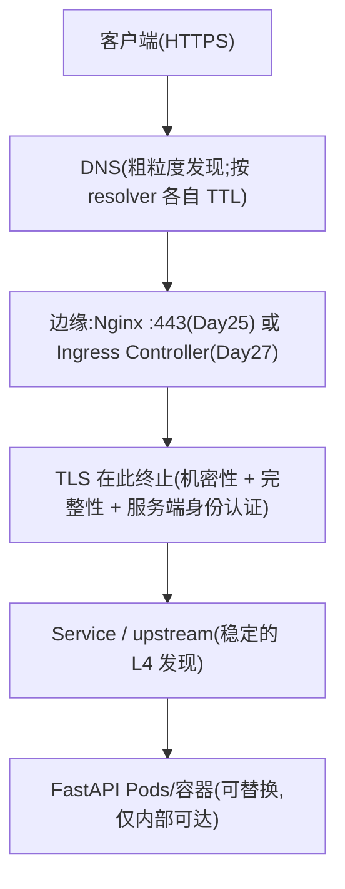
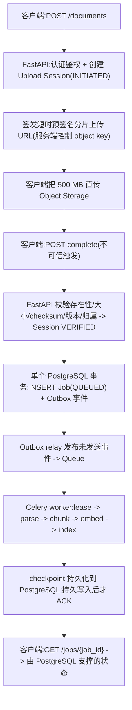
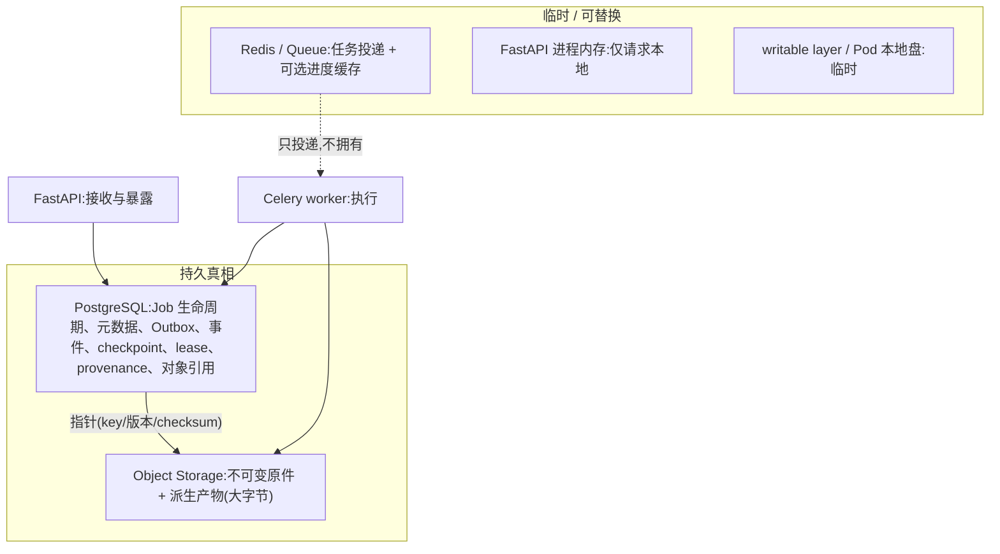
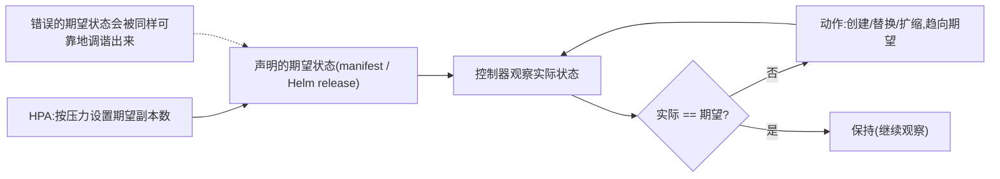
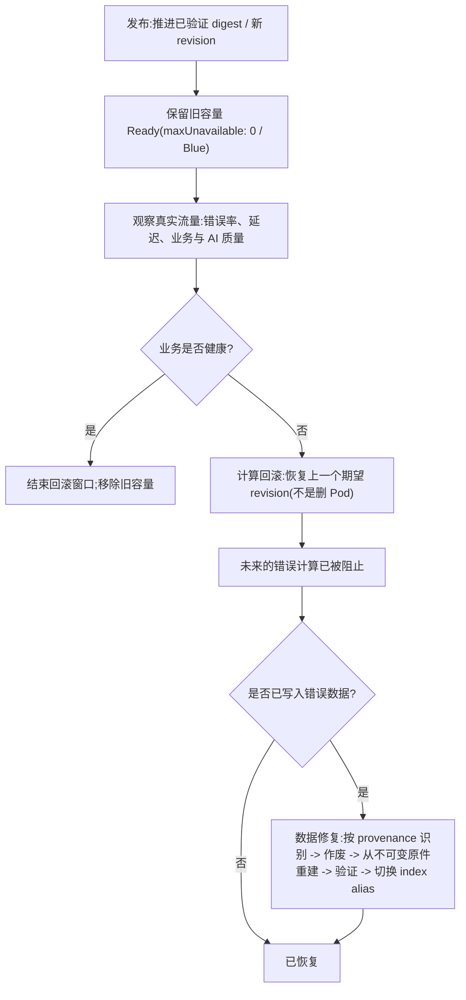
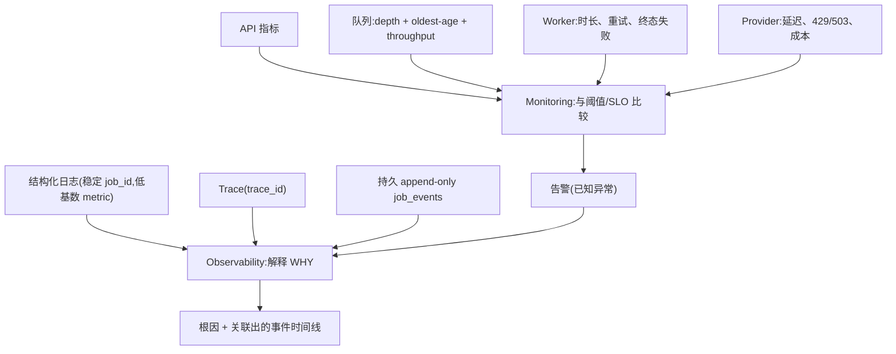

# Day23–Day28 架构与故障地图(中文版)

> 英文原版:[Day23-Day28-Architecture-Failure-Map.md](Day23-Day28-Architecture-Failure-Map.md) ｜ 导航:[README(中文)](README.zh.md)
> 配套:[Super Cheat Sheet](Day23-Day28-Production-Super-CheatSheet.md) · [Artifact Templates](Day23-Day28-Artifact-Templates.md) · [Interview Q&A](Day23-Day28-Interview-QA.md) · [一页速览(中文)](Day23-Day28-OnePage.zh.md)

这是**连接层**:Day23–Day28 的概念如何串成一个生产系统,以及出问题时该看哪一层。[Super Cheat Sheet](Day23-Day28-Production-Super-CheatSheet.md) 负责*解释*每个概念,本文负责*连接*它们,并给出统一的 Failure Matrix。

所有节点、连线和故障条目都只来自 Day23–Day28 课程及其示例制品。仓库没有教过的内容一律不添加。

> **渲染说明:** 下面只使用 GitHub 支持的基础 `flowchart` / `graph` 语法;含空格或标点的标签已加引号,同一张图内节点 ID 唯一。Mermaid 语法只做了静态检查,未实际运行渲染器。

---

## 1. Day23 → Day28 能力演化

每一阶段补上前一阶段缺失的能力。



*阅读方法:* 自上而下是阶段时间线。每一个箭头都意味着"上一层能力存在,但不足以支撑生产",所以下一课才存在。

---

## 2. Source → Image → Container → Compose → Deployment → Kubernetes → AI Backend

制品身份主链:同一个不可变制品如何从源码流到被运维的系统。



*阅读方法:* 全程推进的是**同一个已验证 digest**,绝不按环境重新构建;环境差异放在配置里(Compose spec / ConfigMap / Helm Values),因此"测过的 = 部署的"一直保持到被运维的 AI backend。

---

## 3. 公网请求路径(Day25 + Day27)

外部请求如何抵达应用。



*阅读方法:* 对外契约(域名/URL/TLS)稳定在边缘,后端可随时替换。`localhost` 永远不跨越这条边界——内部跳转一律用 service DNS。

---

## 4. 500 MB 上传 + 异步任务流(Day28)

大文件的"快速接收 / 异步处理"设计。



*阅读方法:* FastAPI 负责接收与承诺,worker 负责执行。字节绕开 API(data plane = Object Storage);真相是 PostgreSQL 的 Job + Outbox(control plane)。投递是 at-least-once,所以副作用必须幂等。

---

## 5. 状态 / 数据归属地图(Day23–Day28)

谁拥有哪一份真相——这是最核心的生产判断。



*阅读方法:* "临时"区里的一切都必须能从"持久真相"重建。Redis 只做投递与加速,永远不是真相来源;PostgreSQL 存指针,Object Storage 存字节。

各组件归属:

| 组件 | 拥有(Owns) | 不拥有(Does Not Own) | 故障模式 | 恢复方式 | 证据 |
|---|---|---|---|---|---|
| FastAPI | 请求/控制平面、`202 + job_id`、预签名 URL、校验 | 持久 Job 真相、长时执行 | 做长任务会超时;Pod 被替换 | 保持无状态;从 PostgreSQL 读取真相 | 请求量、错误率、延迟 |
| Celery worker | 任务执行、checkpoint、ACK 时机 | Job 真相来源、投递保证 | 外部调用成功后、ACK 前崩溃 | lease + 幂等键 + 持久写入后才 ACK | 任务时长、重试率、终态失败数 |
| Redis / Queue | 任务传输、可选缓存 | 持久业务真相 | broker 丢失 / 重复投递 | at-least-once + 幂等消费者;对账 | 队列 depth、oldest age、出入队速率 |
| PostgreSQL | 持久 Job 真相、Outbox、事件、唯一约束 | 大字节、执行 | DB→queue 崩溃间隙 | Transactional Outbox + 对账扫描 | job 状态、事件历史、按阶段卡住数 |
| Object Storage | 大的不可变/派生字节 | 授权、任务状态 | 上传中断/不完整 | 分片 + 重试 + 清理;建 Job 前先校验 | 对象存在性/大小/checksum |
| Monitoring | 已知信号的检测 | 根因、正确性证明 | 告警疲劳 / 误报 | 阈值绑定 SLO;多信号关联 | 指标 vs 阈值 |
| Observability | 通过关联做解释 | 预防 | 高基数爆炸 | 稳定 `job_id`、低基数 metric | 日志 + trace + 持久事件 |

---

## 6. 期望状态与调谐循环(Day26 + Day27)

持续维持声明状态的控制循环。



*阅读方法:* 这个循环执行的是**声明**,不是**正确性**。HPA 改的是*期望副本数*(它不直接创建 Pod)。错误的期望状态(比如错的 Secret)会被放大到所有副本——故障处置时要先控制住"声明",再让控制器动作。

---

## 7. 发布 / 观察 / 回滚 / 数据修复流程(Day25–Day28)

安全发布的完整生命周期,包括回滚**修不了**的那一半。



*阅读方法:* `计算回滚阻止未来的损害;数据修复纠正已经持久化的损害。` Readiness 200 不等于业务成功,所以收尾前要观察业务/AI 信号。回滚的是**声明**,不是删 Pod(控制器会重建)。

---

## 8. 监控与可观测性的证据流(Day28)

信号如何变成"检测"与"解释"。



*阅读方法:* Monitoring 回答"某个已知信号是否异常";Observability 通过稳定 `job_id` 跨组件关联,回答"为什么"。队列信号要合起来看:depth+age 上升且 throughput ≈ 0 = 卡住;throughput 正常 = 容量不足;depth 高但 age 低 = 突发流量。

---

## 统一 Failure Matrix

每一行都是 Day23–Day28 讨论过的故障。"先查"指向拥有该故障的层;恢复手段只用课程教过的机制。

| # | 故障 | 先查哪一层 | 根因(课程原文) | 恢复方式(课程原文) | Day |
|---|---|---|---|---|---|
| 1 | 容器挂掉 | 容器进程 / cgroup | 崩溃或触及资源上限 | 控制器/运维替换;持久状态在 volume/外部存储,不在 writable layer | 23/26 |
| 2 | Compose 依赖起来了但没就绪 | `depends_on` / healthcheck / 应用重试 | 容器 "started" ≠ "ready" | `depends_on: condition: service_healthy` + 真实 healthcheck + 有界应用重试 | 24 |
| 3 | Nginx 或 TLS 故障 | 边缘(Nginx :443 / 证书) | 证书过期使身份失效(是中断,不是明文);配置错误 | 到期前续期,`nginx -t && nginx -s reload`;从外部验证已提供的证书 | 25 |
| 4 | 应用发布有问题 | 蓝绿 / Rolling Update | v2 有问题;readiness 200 ≠ 业务成功 | 切回 Blue / 恢复上一个 revision;观察真实流量;drain | 25/27 |
| 5 | ConfigMap / Secret 错误 | 对象本身 + Pod 替换 | 配置更新 ≠ 运行中进程环境变量更新 | 先修对象,再替换 Pod;确认新值被读取 | 26 |
| 6 | Kubernetes 期望状态错误 | 声明的 manifest / 期望状态 | 调谐会把错误声明执行到所有副本 | 先纠正期望状态,再让受控替换完成自愈 | 26 |
| 7 | HPA 用错指标 | HPA 指标 + 采集链路 | 外部等待型负载 CPU 很低,队列却在涨 | 按 queue backlog / backlog-per-worker 对**消费者**扩缩,并封顶 maxReplicas | 27 |
| 8 | Celery 任务被重复投递 | 队列投递 + worker 幂等 | at-least-once 投递 / 重试 | 幂等键 + 数据库唯一约束 + upsert;持久写入后才 ACK | 28 |
| 9 | 数据库到队列的崩溃间隙 | PostgreSQL Outbox + relay | commit 与 publish 之间崩溃,留下 QUEUED 却无消息 | Transactional Outbox + relay;对陈旧 QUEUED 做对账扫描 | 28 |
| 10 | provider 调用成功后 worker 崩溃 | checkpoint / lease + provider 幂等 | 外部调用已成功,本地 checkpoint 尚未写入 | ACK 前先持久 checkpoint;使用 provider 幂等键;对双写间隙做对账 | 28 |
| 11 | Redis 不可用 | 队列 / 缓存边界 | broker/缓存是临时的,不是持久真相 | 真相在 PostgreSQL;重建投递;任务可从持久状态恢复 | 24/28 |
| 12 | PostgreSQL 不可用 | 持久真相存储 | 单个 StatefulSet ≠ HA(无复制/故障转移) | 需要 operator/托管服务:WAL 复制 + failover + fencing + 备份/PITR | 27/28 |
| 13 | 对象上传不完整 | Upload Session + Object Storage | 客户端中断;直传并不能消除网络故障 | 分片 + 重试 + 清理;建 Job 前先校验;清理 EXPIRED session | 28 |
| 14 | 错误的 embedding model 写入了错误索引 | provenance + 向量/索引层 | 语义故障,但仍能通过 readiness | contain → 恢复计算 → 按 provenance 识别 → 从原件重建 → 验证 → 切 alias | 28 |
| 15 | 计算回滚成功但持久数据仍是错的 | 数据修复边界 | 计算回滚无法修复已持久化的状态/产物/索引 | 数据修复:作废/重处理/验证/带版本重建 + 切 alias;外部副作用需补偿 | 28 |

---

## 八张图如何互相连接

```text
能力演化(1)是时间线。
制品主链(2)是流经它的东西。
请求路径(3)和上传+任务流(4)是两条运行时路径。
归属地图(5)说明这些路径上谁持有真相。
调谐循环(6)维持声明的状态。
发布/回滚/修复(7)安全地改变它。
证据流(8)证明实际发生了什么。
Failure Matrix 是上述任何一环出问题时使用的反向索引。
```

---

# 来源对照(Source Map)

| 图 / 章节 | 仓库来源 |
|---|---|
| 1. 能力演化 | `docs/devops/day23-...` … `docs/devops/day28-...`、`ROADMAP.md` |
| 2. 制品主链 | `docs/devops/day23-docker-fundamentals.md`、`docs/devops/day25-deployment-foundations.md` |
| 3. 公网请求路径 | `docs/devops/day25-deployment-foundations.md`、`docs/devops/day27-kubernetes-workloads.md` |
| 4. 上传 + 异步任务流 | `docs/devops/day28-ai-backend-production-architecture.md`、`examples/ai-backend-architecture/README.md` |
| 5. 状态/数据归属 | `docs/devops/day28-...`、`examples/ai-backend-architecture/README.md`、`docs/devops/day23-...`、`docs/devops/day24-...` |
| 6. 调谐循环 | `docs/devops/day26-kubernetes-foundations.md`、`docs/devops/day27-kubernetes-workloads.md` |
| 7. 发布/回滚/数据修复 | `docs/devops/day25-...`、`docs/devops/day27-...`、`docs/devops/day28-...` |
| 8. 监控与可观测性 | `docs/devops/day28-...`、`examples/ai-backend-architecture/README.md` |
| Failure Matrix | `docs/devops/day23-...` 至 `docs/devops/day28-...` |
