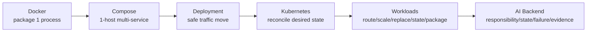

# Day23–Day28 Production Engineering — One Page

> 5–10 minute recall. Deeper: [Super Cheat Sheet](Day23-Day28-Production-Super-CheatSheet.md) · [Architecture & Failure Map](Day23-Day28-Architecture-Failure-Map.md) · [Artifact Templates](Day23-Day28-Artifact-Templates.md) · [Interview Q&A](Day23-Day28-Interview-QA.md) · [README](README.md)

**Phase sentence:** a running system is not an architecture — assign, for every change and byte: *artifact identity, runtime lifecycle, state ownership, network boundary, desired state, failure boundary, rollback boundary, data repair, monitoring, observability.*

## Knowledge chain



## Compressed model
- **Docker** → package one process into an immutable image; run replaceable containers.
- **Compose** → declare a reproducible multi-service system on one host.
- **Deployment** → move a verified artifact into production safely and reversibly.
- **Kubernetes** → continuously reconcile desired state.
- **Workloads** → route (Ingress), scale (HPA), replace (Rolling Update), preserve identity (StatefulSet), package (Helm).
- **AI Backend** → assign responsibility, lifecycle, state, failure, and evidence.

## Ultimate model
```text
Built Artifact != Running Container != Reachable Service != Healthy Business != Correct Persisted Data
Compute rollback stops future damage.  Data repair corrects damage already persisted.
```

## Day23 Docker
- `Dockerfile -> build -> Image (immutable) -> run -> Container (replaceable process)`.
- Container = isolated process (namespaces + cgroups), NOT a VM. Build ≠ run.
- Deps before app code (cache). Durable state → volume/external, never the writable layer. `localhost` = current container → use service DNS. Rebuild+replace, never edit a live container.

## Day24 Compose
- Compose = declarative multi-service spec on ONE host (Project → Services → Containers). **Started ≠ ready.**
- `depends_on` (start) vs healthcheck (ready, no repair) vs app retry (runtime) — need all three.
- Only API publishes a host port; internal = service DNS. Network segmentation (Redis & PostgreSQL share no network). `down` keeps volumes; `--volumes` deletes. Volume ≠ backup. Compose ≠ cluster (no scheduling/self-healing/autoscaling/rollout).

## Day25 Deployment
- Deployment = serialized, observable, reversible state transition promoting the exact verified digest.
- `listen`/`server_name` = public; `proxy_pass api:8000` = internal. TLS = confidentiality + integrity + server auth (terminates at Nginx). 308 doesn't protect a token already sent. Expired cert = outage (not plaintext).
- Blue-green: start Green → verify direct → `nginx -t` → switch → observe + drain → roll back / finish. Health ≠ success. PostgreSQL = Expand-Migrate-Contract. Worker = compatible-consumer-first. DNS TTL expires per resolver (gradual). Buffering ≠ caching.

## Day26 Kubernetes
- Declare desired state; controllers `observe → diff → act`. Script = act once; K8s = maintain.
- Pod = smallest unit (1+ tightly coupled containers). Deployment = template + count (recovery, NOT scheduling; scheduler places). Service = stable label-based discovery. ConfigMap = non-sensitive config outside the image; Secret = sensitive (**Base64 = encoding, not encryption**; not an auto-vault).
- Config/Secret change ≠ running process env changed (replace Pods). Health 200 ≠ business success. A wrong desired state is amplified across replicas.

## Day27 Workloads
- Ingress = L7 Host/Path/TLS to Services (resource declares, controller implements). Not "internal vs external."
- HPA sets desired replicas on a scale target (NOT create Pods); scale on queue backlog (consumer), not CPU, capped by provider capacity.
- Rolling Update = gradual same-selector replacement (`maxSurge`/`maxUnavailable: 0`); ≠ Blue-Green, ≠ rollback. Deleting Pods ≠ rollback (restore a revision). StatefulSet = identity + per-Pod PVC + order, **NOT replication/HA/backup**. Helm = templates + Values + release; static validation ≠ business success; never commit real Secrets to Values.

## Day28 AI Backend
- FastAPI accepts/exposes (`202 + job_id`); Celery executes; Redis/Queue transports; PostgreSQL owns durable truth; Object Storage owns bytes.
- DB→queue crash gap → **Transactional Outbox** (state + intent atomic) → still **at-least-once + idempotent**.
- Idempotency key `(document_id, chunk_hash, model_version)` + DB unique constraint + upsert; **ACK after durable write**. Presigned multipart direct upload + Upload Session; verify before creating the Job (client "complete" is untrusted).
- Retry = backoff + jitter + max attempts/deadline + classification + circuit breaker. Monitor depth + oldest-age + throughput. Correlate on stable `job_id` (not job_status); low-cardinality metrics. Contain → restore → identify (provenance) → reprocess → verify → alias switch.

## Ten most dangerous production misconceptions
1. Editing a live container is a hotfix (no audit/rollback). 2. "Started" = "ready." 3. Rebuild per environment instead of promoting the digest. 4. Expired cert = plaintext (it's an outage). 5. A Deployment schedules Pods (the scheduler does). 6. Base64 Secret = encrypted. 7. Health 200 = business success. 8. Deleting v2 Pods = rollback (the controller recreates them). 9. StatefulSet = database HA. 10. Read-then-upsert = exactly-once (assume at-least-once; compute rollback ≠ data repair).

## Ten English interview core sentences
1. "A container is an isolated process sharing the host kernel, not a VM."
2. "Compose is a tool for declaring a reproducible multi-service system on one host."
3. "`depends_on` waits for start; a healthcheck proves readiness; retry handles runtime failure."
4. "Deployment promotes the exact verified digest; runtime differences live in configuration."
5. "TLS is confidentiality, integrity, and server authentication; it terminates at the proxy."
6. "A Deployment maintains replicas; the scheduler places Pods; a Service gives stable discovery."
7. "Base64 is encoding, not encryption; health 200 is not business success."
8. "Rolling Update keeps old Pods until new ones are Ready; roll back by restoring a revision."
9. "A StatefulSet gives identity and storage, not database high availability."
10. "Assume at-least-once and make effects idempotent; compute rollback does not repair data."

## Failure → inspect first
```text
container dies -> process/cgroup | started-not-ready -> depends_on/healthcheck/retry
Nginx/TLS -> edge/cert | bad release -> blue-green/rolling update | bad Config/Secret -> object + replace Pods
wrong desired state -> declaration | wrong HPA metric -> metric/pipeline | task redelivery -> idempotency
DB->queue gap -> Outbox/relay | worker crash after provider success -> checkpoint/lease | Redis down -> truth in PostgreSQL
PostgreSQL down -> needs operator/HA | upload incomplete -> Upload Session/multipart | wrong embeddings -> provenance + data repair
```

## Validation boundary (honesty)
All Day23–Day28 example artifacts are teaching/conceptual templates: no runnable app, domain, certificate, cluster, or provider account exists in this repo. `docker build/run`, `docker compose up`, `nginx -t`, `kubectl apply`, `helm install`, and any AI-backend runtime were **NOT executed**. Only static reasoning / `docker compose config` / `helm lint`/`helm template` / deterministic static checks apply. `Static validation != runtime success.`

## Knowledge boundary
Learned: Docker → Compose → Deployment → Kubernetes (foundations + workloads) → Production AI Backend architecture (Phase 2 close). **Next (Phase 3 Backend Foundations):** PostgreSQL, SQL, Redis, Database Design deepen the durable-data/transaction/schema boundaries. Day29 is planned; its lesson file does not exist yet.

---
**Source Map:** `docs/devops/day23-...` through `docs/devops/day28-...`; `examples/{docker,deployment,kubernetes,ai-backend-architecture}/`; `CURRICULUM.md`; `ROADMAP.md`.
