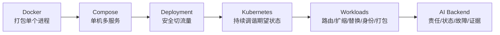

# Day23–Day28 生产工程 · 一页速览(中文版)

> 5–10 分钟快速回忆。英文原版:[Day23-Day28-OnePage.md](Day23-Day28-OnePage.md)
> 深入:[Super Cheat Sheet](Day23-Day28-Production-Super-CheatSheet.md) · [架构与故障地图(中文)](Day23-Day28-Architecture-Failure-Map.zh.md) · [Artifact Templates](Day23-Day28-Artifact-Templates.md) · [Interview Q&A](Day23-Day28-Interview-QA.md) · [README(中文)](README.zh.md)

**本阶段一句话:** 系统能跑起来不等于有架构——必须为每一次变更、每一个字节指派:*artifact identity、runtime lifecycle、state ownership、network boundary、desired state、failure boundary、rollback boundary、data repair、monitoring、observability*。

## 知识链



## 压缩模型
- **Docker** → 把一个进程打包成不可变 image;运行可替换的 container。
- **Compose** → 在单台主机上声明一个可复现的多服务系统。
- **Deployment** → 把已验证的 artifact 安全、可回退地送入生产流量。
- **Kubernetes** → 持续调谐期望状态。
- **Workloads** → 路由(Ingress)、扩缩(HPA)、替换(Rolling Update)、保持身份(StatefulSet)、打包(Helm)。
- **AI Backend** → 指派责任、生命周期、状态、故障边界与证据。

## 终极模型
```text
Built Artifact != Running Container != Reachable Service != Healthy Business != Correct Persisted Data
计算回滚只能阻止未来的损害。数据修复才能纠正已经持久化的损害。
```

## Day23 Docker
- `Dockerfile -> build -> Image(不可变) -> run -> Container(可替换进程)`。
- Container = 隔离的进程(namespaces + cgroups),**不是** VM。build ≠ run。
- 依赖层放在应用代码之前(缓存)。持久状态 → volume/外部存储,绝不放 writable layer。`localhost` = 当前容器 → 用 service DNS。重建替换,绝不改动运行中的容器。

## Day24 Compose
- Compose = 单机上的声明式多服务规格(Project → Services → Containers)。**started ≠ ready。**
- `depends_on`(启动)vs healthcheck(就绪,不做修复)vs 应用重试(运行期)——三者都需要。
- 只有 API 发布 host port;内部走 service DNS。网络分段(Redis 与 PostgreSQL 不共享 network)。`down` 保留 volume;`--volumes` 才删除。volume ≠ 备份。Compose ≠ 集群(无调度/自愈/自动扩缩/滚动发布治理)。

## Day25 Deployment
- Deployment = 串行化、可观察、可逆的生产状态转移,推进的是**同一个已验证 digest**。
- `listen`/`server_name` = 对外;`proxy_pass api:8000` = 对内。TLS = 机密性 + 完整性 + 服务端身份认证(在 Nginx 终止)。308 无法保护已经用 HTTP 发出去的 token。证书过期 = 中断(不是明文)。
- 蓝绿:启动 Green → 直接验证 → `nginx -t` → 切流量 → 观察 + drain → 回退或收尾。健康 ≠ 成功。PostgreSQL 用 Expand-Migrate-Contract。Worker 先上兼容消费者。DNS TTL 按各自 resolver 过期(渐进,非原子)。buffering ≠ caching。

## Day26 Kubernetes
- 声明期望状态;控制器持续 `observe → diff → act`。脚本 = 执行一次;K8s = 持续维持。
- Pod = 最小部署单元(1 个或多个紧耦合容器)。Deployment = 模版 + 副本数(负责恢复,**不负责调度**;scheduler 才做调度)。Service = 基于 label 的稳定发现。ConfigMap = 镜像外的非敏感配置;Secret = 敏感值(**Base64 是编码,不是加密**;不是自动保险库)。
- Config/Secret 变更 ≠ 运行中进程的环境变量变更(要替换 Pod)。健康 200 ≠ 业务成功。**错误的期望状态会被同样可靠地放大到所有副本。**

## Day27 Workloads
- Ingress = L7 的 Host/Path/TLS 路由到 Service(resource 声明意图,controller 才实现)。不是"内部 vs 外部"。
- HPA 只是修改 scale target 的期望副本数(**不直接创建 Pod**);外部等待型负载应按 queue backlog(消费者)扩缩,而不是 CPU,并以上游容量封顶。
- Rolling Update = 同 selector 下的渐进替换(`maxSurge`/`maxUnavailable: 0`);≠ 蓝绿,≠ 回滚。删 Pod ≠ 回滚(要恢复上一个 revision)。StatefulSet = 身份 + 每 Pod PVC + 顺序,**不是复制/HA/备份**。Helm = templates + Values + release;静态验证 ≠ 业务成功;绝不把真实 Secret 写进 Values。

## Day28 AI Backend
- FastAPI 负责接收与暴露(`202 + job_id`);Celery 执行;Redis/Queue 传输;PostgreSQL 拥有持久真相;Object Storage 拥有大字节。
- DB→queue 崩溃间隙 → **Transactional Outbox**(状态 + 投递意图原子写入)→ 仍然是 **at-least-once + 幂等**。
- 幂等键 `(document_id, chunk_hash, model_version)` + 数据库唯一约束 + upsert;**持久写入之后才 ACK**。预签名分片直传 + Upload Session;验证通过后才创建 Job(客户端的"完成"回调不可信)。
- 重试 = backoff + jitter + 最大次数/截止时间 + 错误分类 + 熔断。监控看 depth + oldest-age + throughput。用稳定的 `job_id` 关联(不是 job_status);metric label 保持低基数。故障处置:contain → restore → 按 provenance 识别 → 重建 → 验证 → 切换 index alias。

## 十个最危险的生产误区
1. 进容器改代码当热修(无审计、无回滚)。2. "started" 当成 "ready"。3. 每个环境重新构建,而不是推进同一个 digest。4. 以为证书过期会变明文(其实是中断)。5. 以为 Deployment 负责调度(其实是 scheduler)。6. 以为 Base64 的 Secret 是加密的。7. 把健康 200 当业务成功。8. 删 v2 Pod 当回滚(控制器会重建)。9. 把 StatefulSet 当数据库 HA。10. 以为先查再 upsert 就是 exactly-once(应假设 at-least-once;计算回滚 ≠ 数据修复)。

## 十句英文面试核心句
1. "A container is an isolated process sharing the host kernel, not a VM."
2. "Compose is a tool for declaring a reproducible multi-service system on one host."
3. "`depends_on` waits for start; a healthcheck proves readiness; retry handles runtime failure."
4. "Deployment promotes the exact verified digest; runtime differences live in configuration."
5. "TLS is confidentiality, integrity, and server authentication; it terminates at the proxy."
6. "A Deployment maintains replicas; the scheduler places Pods; a Service gives stable discovery."
7. "Base64 is encoding, not encryption; health 200 is not business success."
8. "Rolling Update keeps old Pods until new ones are Ready; roll back by restoring a revision."
9. "A StatefulSet gives identity and storage, not database high availability."
10. "Assume at-least-once and make effects idempotent; compute rollback does not repair data."

## 故障 → 先查哪一层
```text
容器挂掉 -> 进程/cgroup            | 起了但没就绪 -> depends_on/healthcheck/重试
Nginx/TLS -> 边缘/证书             | 发布有问题 -> 蓝绿/Rolling Update
Config/Secret 错 -> 对象 + 替换 Pod | 期望状态错 -> 声明本身
HPA 指标错 -> 指标/采集链           | 任务重投 -> 幂等键/唯一约束
DB->queue 间隙 -> Outbox/relay      | provider 成功后 worker 崩 -> checkpoint/lease
Redis 不可用 -> 真相在 PostgreSQL   | PostgreSQL 不可用 -> 需要 operator/HA
上传不完整 -> Upload Session/分片   | Embedding 写错 -> provenance + 数据修复
```

## 验证边界(诚实声明)
Day23–Day28 的全部示例都是教学/概念模版:本仓库没有可运行的应用、域名、证书、集群或模型提供商账号。`docker build/run`、`docker compose up`、`nginx -t`、`kubectl apply`、`helm install` 以及任何 AI backend 运行时**均未执行**。只适用静态推理 / `docker compose config` / `helm lint`、`helm template` / 仓库自带的确定性静态检查。`静态验证 != 运行时成功。`

## 知识边界
已学:Docker → Compose → Deployment → Kubernetes(基础 + 工作负载)→ 生产 AI Backend 架构(Phase 2 收官)。**下一步(Phase 3 后端基础):** PostgreSQL、SQL、Redis、数据库设计,深化这里引入的持久数据/事务/schema 边界。Day29 已在规划中,但课程文件尚不存在。

---
**来源:** `docs/devops/day23-...` 至 `docs/devops/day28-...`;`examples/{docker,deployment,kubernetes,ai-backend-architecture}/`;`CURRICULUM.md`;`ROADMAP.md`。
