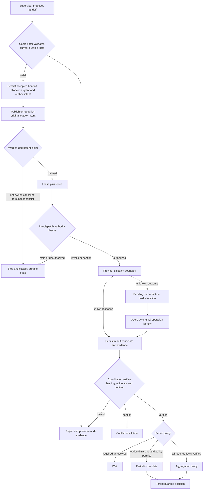

# Day 85 — Multi-agent Handoff and Coordination Boundaries

> Classroom design note. This is an isolated teaching artifact, not a published repository lesson or release record.

## Purpose

Day 85 turns multi-agent execution into a controlled coordination protocol. A supervisor may propose work, but only the coordinator can validate the proposal against current durable facts and persist an accepted handoff. A worker may execute only after an idempotent claim establishes a valid lease and fence. A child result remains a candidate until the coordinator verifies its identity, evidence, authority, and output contract.

The implementation is deliberately in-memory and deterministic. It demonstrates boundaries and failure handling; it does not claim production reliability or real infrastructure integration.

## First-use glossary

- **Supervisor**: proposes child work and candidate assignments. It does not grant itself execution authority.
- **Coordinator**: the validation boundary that reads current authoritative facts, accepts or rejects handoffs, controls claims and dispatch, verifies results, and produces aggregation facts.
- **Worker**: executes an accepted child attempt only within its delegated grant, allocation, lease, and fence.
- **Handoff**: the controlled lifecycle from a parent proposal through durable acceptance, child execution, result verification, and fan-in.
- **Delegation grant**: a bounded subset of authority explicitly granted to a child. Context content is not authority.
- **Claim**: an idempotent durable transition that gives one worker ownership of one attempt.
- **Lease**: time-bounded execution permission. Expiry removes permission but does not physically stop a process.
- **Fence**: a monotonically advancing token checked at guarded writes and before dispatch. A stale token is rejected.
- **Outbox intent**: a durable message-publication intent written with the accepted state so an unpublished intent can be retried safely.
- **Operation identity**: the stable identity used to correlate a provider operation across timeouts, retries, and reconciliation.
- **Fan-in**: verification and aggregation of child results back into the parent decision.
- **Pending reconciliation**: a non-terminal state for an operation whose external outcome may exist but is not yet known.
- **Compensation**: a separately authorized lifecycle that mitigates an already-occurring external effect; it is not history deletion or a blind retry.

## Authority and state flow

`Aggregation ready` is not permission to publish. The parent still needs the current Day 83 execution decision and approval checks.

## Core invariants

1. A delivered message is not a durable acceptance, claim, lease, or execution authorization.
2. A context package supplies information; it never grants business authority.
3. The same `handoff_id` and fingerprint is idempotent and returns the existing durable fact. The same identity with different semantics is a conflict and is never silently overwritten.
4. A worker dispatch requires a current accepted binding, current delegation grant, active claim, live lease, matching fence, valid allocation, and current policy.
5. `sum(active child allocations) <= parent reservation`. Concurrency is permitted inside that bound; linear execution is not required.
6. An unknown provider outcome keeps the allocation held and uses the original operation identity for reconciliation. It does not create a fresh attempt immediately.
7. A duplicate claim that changes zero rows must reread and classify durable state. Zero rows alone does not prove a harmless duplicate.
8. A result is only a candidate until its tenant, job, attempt, handoff, step, owner, fence, source, output contract, and evidence are verified.
9. Required children must be resolved before parent progress. Missing optional children may produce an explicit partial result only when policy permits.
10. Cancellation before dispatch releases capacity only after proving no external effect. Post-dispatch cancellation is cooperative and uncertain outcomes enter reconciliation.
11. An already-terminal parent never reopens because of a late child result; the result is retained as audit evidence.
12. Compensation has an independent identity, authority, approval, evidence, budget, and lifecycle.

## Failure matrix

| Situation | Required response | Forbidden shortcut |
|---|---|---|
| Duplicate handoff, same fingerprint | Return existing accepted record | Advance the lifecycle again |
| Duplicate identity, different fingerprint | Semantic conflict and audit | Last-write-wins |
| Crash before claim | Another worker may claim | Invent a lease for the crashed worker |
| Live lease owned by worker A | Worker B waits or is rejected | Concurrent ownership |
| Expired lease | Controlled takeover with new fence | Reuse old fence |
| Lost ACK for outbox delivery | Republish original unpublished intent | Create a new handoff identity |
| Provider outcome unknown | `pending_reconciliation`, hold allocation | Blind retry with a new attempt |
| Required child still running | Wait | Call the result complete or partial |
| Result conflict | Resolve correlated identities and facts | Supervisor guesses a winner |
| Parent already terminal | Preserve late evidence | Reopen the parent |

## Rollback and incident containment

For an erroneous policy version, containment first prevents new acceptance, claims, undispatched execution, and parent aggregation under that version. It revokes or freezes expanded grants, freezes suspicious allocations, isolates dispatched children, and preserves bindings, outbox rows, dispatch markers, operation identities, and audit evidence.

Affected records are found from durable policy bindings and provenance, then classified as confirmed undispatched, result verified, or result unknown. Undispatched allocations may be released after proof. Verified usage is settled and the remainder returned to the parent reservation. Unknown outcomes remain held in reconciliation. Harmful external effects require separately approved compensation.

Incident closure additionally requires complete tenant/parent/child/operation scope, verified privilege exposure, budget settlement, owners and deadlines for unknown results, sibling and parent impact checks, continuous audit history, controlled recovery, and explicit monitoring-exit criteria.

## Implemented classroom surface

The artifact supplies immutable coordination records and decisions; exact duplicate/conflict detection; grant, depth, fanout, concurrency, deadline, context, and budget validation; outbox recovery; lease/fence ownership; dispatch authorization; result verification; cancellation; reconciliation; aggregation; and deterministic fake workers.

It intentionally leaves parent completion false. Day 85 produces verified aggregation facts; the Day 83 execution boundary remains responsible for any final business action.

## Honest execution boundary

The example and tests use an in-memory store, synthetic clock values, and fake workers. They make zero real provider or tool calls. PostgreSQL, a broker, multiprocess concurrency, network partitions, real provider billing, clock skew, production fencing, and model-quality evaluation were not run.
