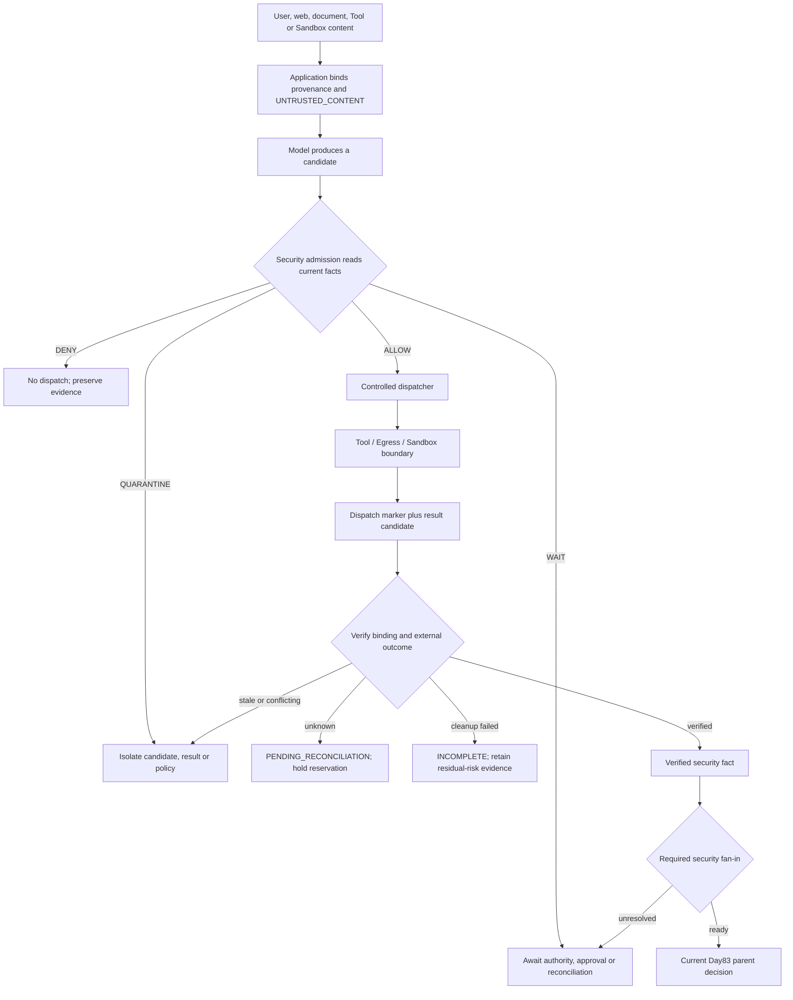

# Day 86 — Agent Security Boundaries

> Classroom design note. This isolated artifact is not a published release or proof of production security.

## Purpose

Day86 adds an application-owned security layer to the Day85 coordination boundary. External content can inform model candidates but cannot become instruction authority. The security core validates current identity, delegated capability, approval, tenant, resource, Egress and Sandbox facts, then emits only `ALLOW`, `DENY`, `WAIT` or `QUARANTINE`. A separate dispatcher owns effects, and every returned value remains a candidate until verified.

## First-use glossary

- **Trusted instruction**: control input from an application-recognized source, verified and bound to the current contract. Text cannot declare itself trusted.
- **Untrusted content**: user, web, document, Tool, Agent or Sandbox material that may supply data but cannot create authority.
- **Direct injection**: hostile or authority-changing instructions supplied through user input.
- **Indirect injection**: hostile instructions embedded in webpages, documents, Tool results or other retrieved material.
- **Provenance**: application-bound identity, source version, channel and integrity evidence describing where content came from.
- **Tool candidate**: the model's structured suggestion for one Tool call; it is not a dispatch authorization.
- **Security admission**: the final application check of current facts before a Tool, Egress or Sandbox boundary is crossed.
- **Confused deputy**: a privileged component tricked into using its own authority for a requester that lacks that authority.
- **Egress**: data crossing from the application into a Provider, Tool, log, Artifact store or recipient.
- **Disclosure budget**: the permitted fields, amount or precision of data for one purpose, audience and destination.
- **Credential reference**: an opaque identifier resolved by a trusted runtime component after authorization; it is not the raw Secret.
- **Sandbox profile**: the application-owned maximum file, network, environment, process and resource scope for execution.
- **Dispatch marker**: durable evidence that the request crossed, or may have crossed, the external boundary.
- **Result candidate**: a returned claim that has not yet been independently verified against current bindings and external state.
- **Pending reconciliation**: the state used when a dispatched operation's external effect is unknown.
- **Residual risk**: security-relevant state that remains after the main operation, such as a failed temporary-directory cleanup.
- **Compensation**: a separately authorized action that mitigates an existing effect without erasing its history.

## Boundary flow



## Core invariants

1. Content cannot assign its own trust class, approval, delegated grant, policy or Sandbox profile.
2. Injection classification is a risk signal; a false negative never promotes external content to trusted instruction.
3. Tool visibility and schema validity create candidates only.
4. Admission uses current authoritative facts immediately before dispatch and fails closed when those facts are unavailable or unknown.
5. A high-privilege deputy checks the original requester's current scope; it cannot substitute its own permissions.
6. Tenant, resource, purpose, audience, destination and allowed fields are bound independently for each Egress sink.
7. Raw Secrets never enter Prompt, model-visible context, Tool arguments, logs or Artifacts. Only a trusted adapter resolves a controlled reference.
8. A Sandbox request may be equal to or narrower than the application profile; it can never expand network, paths, environment or process capability.
9. Sandbox output and Tool output are new untrusted result candidates and cannot chain another Tool call without fresh admission.
10. `ALLOW` is a pre-dispatch decision. It is not a dispatch marker and not a verified outcome.
11. After dispatch, timeout or kill means the effect may exist. The original operation identity is reconciled before retry and its reservation remains held.
12. Tool business success plus cleanup failure yields overall `INCOMPLETE`, with residual-risk evidence retained.
13. Old-policy and stale-fence results remain evidence but cannot mutate current state.
14. Required quarantined security work blocks fan-in. Ready fan-in still cannot complete or publish the parent.
15. Rollback stops new harm, reconciliation determines facts, compensation mitigates known effects and append-only audit preserves history.

## Admission order

The reference implementation evaluates high-risk bindings before dispatch:

```text
authority available
  -> tenant and resource tenant
  -> current policy and fence
  -> exact Tool, version and capability
  -> current permission and delegated grant
  -> argument names and required fields
  -> exact approval binding
  -> purpose, audience, destination and allowed fields
  -> raw-Secret prohibition
  -> Sandbox read/write/network/env/process confinement
  -> ALLOW
```

The first typed failure is returned and all effect ports remain at zero calls.

## Evidence boundary

Security evidence retains identifiers and protected references rather than raw payloads. The useful minimum includes tenant, Job, Attempt, Step, handoff, operation, outbox intent, reservation/allocation, delegated-grant reference, Artifact/provenance reference and hash, recipient, approval, destination, Sandbox profile, policy/Tool versions, outcome/context contracts, dispatch marker, provider request identity, fence, lease and correlation identity.

## Unknown outcome and cleanup matrix

| Condition | State | Reservation | Next action |
|---|---|---|---|
| Confirmed pre-dispatch | `NOT_DISPATCHED` | release after no-effect proof | retry only through new current admission |
| Dispatch marker plus no reliable outcome | `PENDING_RECONCILIATION` | held | query original operation/provider identity |
| Verified intended effect | `VERIFIED` | settle usage; release remainder | continue guarded fan-in |
| Verified harmful effect | incident/quarantine | settle known usage | contain and authorize compensation |
| Tool success plus cleanup failure | `INCOMPLETE` | business settlement follows verified Tool effect | retry cleanup idempotently and verify |

## Bad-policy incident lifecycle

1. Quarantine the affected policy release and block new acceptance, claim, dispatch, Egress and fan-in.
2. Determine the complete policy/release/time window and affected tenant, Job, Attempt, Step, handoff, source and operation set.
3. Preserve bindings, hashes, dispatch markers, operation/provider identities, approvals, grants, reservations and audit events.
4. Classify every operation as undispatched, verified intended effect, outcome unknown or confirmed exfiltration.
5. Release confirmed unused capacity, settle verified usage and hold unknown capacity through reconciliation.
6. Revoke or rotate exposed credentials and investigate their use.
7. Perform deletion, withdrawal or notification only through independently authorized compensation.
8. Check parent, siblings, Artifacts, logs and external recipients.
9. Roll out a known-safe policy under controlled monitoring.
10. Close only after the affected scope is resolved, or after an explicit residual-risk acceptance process; an owner and deadline alone are insufficient.

## Implemented classroom surface

- provenance/trust binding for external channels;
- canonical argument and approval fingerprints;
- exact current admission checks;
- deterministic Fake Tool, Egress and Sandbox ports;
- dispatch/result candidate modelling and result verification;
- operation semantic-conflict detection;
- required security fan-in;
- bad-policy quarantine and incident classification;
- append-only incident audit and independently authorized compensation boundary;
- 25 versioned seed cases and deterministic scenario output.

## Honest execution boundary

The implementation is deterministic, in-process and in-memory. The Sandbox profile is a policy model, not OS/container isolation. Fake Tool, Fake Egress and Fake Sandbox ports make zero real external calls. Python 3.12, real Provider, external Tool, real network Egress, Secret manager, PostgreSQL, Outbox Relay, Broker, multiple Workers, OS/container Sandbox, CPU/memory/storage exhaustion, real cleanup recovery, production IAM and deployment were not run.
